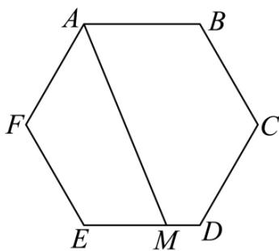

<!-- question-source:start -->
4. 如图，在正六边形 $ABCDEF$ 中，点 $M$ 满足 $\overrightarrow{EM} = 2MD$ ，则 $\overrightarrow{AM} = (\quad)$

A. $2AB + \frac{1}{3} BC$ B. $-\frac{1}{3} AB + 2BC$ C. $\frac{1}{3} AB + \overrightarrow{BC}$ D. $\frac{4}{3} AB + \frac{2}{3}\overrightarrow{BC}$
<!-- question-source:end -->

![[Q00092761A1]]
