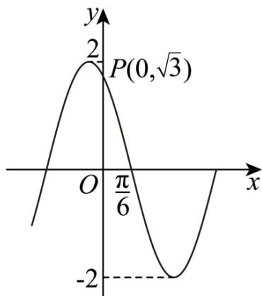

<!-- question-source:start -->
13. 函数 $f(x) = A \sin (\omega x + \varphi)$ ( $A < 0, 0 < \omega < 3, -\frac{\pi}{2} < \varphi < 0$ ) 的部分图象（点 $P$ 在图象上）如图所示，则 $f(x)$ 的解析式为 \_\_\_\_.

<!-- question-source:end -->

![[Q00092770A1]]
