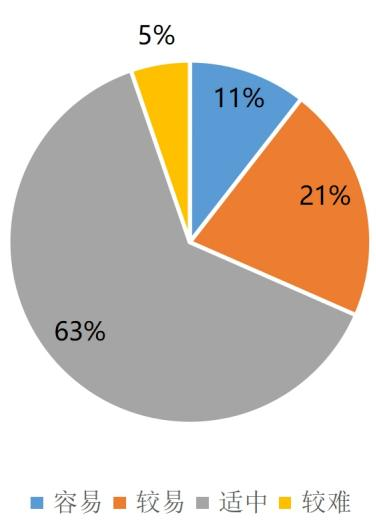

<!-- question-source:start -->
19. 定义: 若非零向量 $\overrightarrow{OM} = (a, b)$ ，函数 $f(x)$ 的解析式满足 $f(x) = a \sin x + b \cos x$ ，则称 $f(x)$ 为 $\overrightarrow{OM}$ 的伴随函数， $\overrightarrow{OM}$ 为 $f(x)$ 的伴随向量，

(1) 若向量 $\overrightarrow{OM}$ 为函数 $f(x)=2\sin\left(x+\frac{\pi}{6}\right)+4\sin\left(x-\frac{\pi}{2}\right)$ 的伴随向量，求 $\left|OM\right|$ ;

(2) 若函数 $f(x)$ 为向量 $\overrightarrow{OM} = (\sqrt{3}, -1)$ 的伴随函数，在 $\Delta ABC$ 中， $f(A) = 1$ ，且 $\sin(B-C)=\frac{\sqrt{3}}{4}$ ，求证： $\tan B=3\tan C$ .

(3) 若函数 $f(x)$ 为向量 $\overrightarrow{OM} = (2, 1)$ 的伴随函数，关于 x 的方程

$f(x) = m + 2\cos^2\frac{x}{2} - 2\sqrt{3} |\cos x|$ 在 $[0, 2\pi]$ 上有且仅有四个不相等的实数根，求实数 $m$ 的取值范围.

# 内蒙古包头市第九十五中学(包钢一中)2024-2025学年高一下学期4月月考数

学试卷

整体难度：适中

考试范围：平面向量、三角函数与解三角形、函数与导数、等式与不等式

试卷题型

<table><tr><td>题型</td><td>数量</td></tr><tr><td>单选题</td><td>8</td></tr><tr><td>多选题</td><td>3</td></tr><tr><td>填空题</td><td>3</td></tr><tr><td>解答题</td><td>5</td></tr></table>

试卷难度

<table><tr><td>难度</td><td>题数</td></tr><tr><td>容易</td><td>2</td></tr><tr><td>较易</td><td>4</td></tr><tr><td>适中</td><td>12</td></tr><tr><td>较难</td><td>1</td></tr></table>

细目表分析

<table><tr><td>题号</td><td>难度系数</td><td>详细知识点</td></tr><tr><td colspan="3">一、单选题</td></tr><tr><td>1</td><td>0.85</td><td>零向量与单位向量;相等向量;向量减法的法则</td></tr><tr><td>2</td><td>0.65</td><td>正、余弦齐次式的计算;二倍角的正弦公式;已知弦(切)求切(弦);二倍角的余弦公式</td></tr><tr><td>3</td><td>0.65</td><td>已知模求数量积;求投影向量</td></tr><tr><td>4</td><td>0.85</td><td>用基底表示向量;向量加法法则的几何应用;向量减法法则的几何应用;向量的线性运算的几何应用</td></tr><tr><td>5</td><td>0.65</td><td>比较正弦值的大小;用和、差角的正弦公式化简、求值;二倍角的正弦公式;二倍角的余弦公式</td></tr><tr><td>6</td><td>0.85</td><td>三角恒等变换的化简问题;给值求角型问题;用和、差角的余弦公式化简、求值</td></tr><tr><td>7</td><td>0.65</td><td>利用余弦函数的单调性求参数;利用cosx(型)函数的对称性求参数</td></tr><tr><td>8</td><td>0.65</td><td>sinα±cosα和sinα·cosα的关系;根据函数的单调性解不等式;一元二次不等式在某区间上的恒成立问题;由函数奇偶性解不等式</td></tr><tr><td colspan="3">二、多选题</td></tr><tr><td>9</td><td>0.94</td><td>描述正(余)弦型函数图象的变换过程;诱导公式一</td></tr><tr><td>10</td><td>0.65</td><td>求含sinx(型)函数的值域和最值;求正弦(型)函数的对称轴及对称中心;求sinx型三角函数的单调性;求函数零点或方程根的个数</td></tr><tr><td>11</td><td>0.65</td><td>由正弦(型)函数的值域(最值)求参数;辅助角公式</td></tr><tr><td colspan="3">三、填空题</td></tr><tr><td>12</td><td>0.85</td><td>数量积的运算律;已知数量积求模</td></tr><tr><td>13</td><td>0.65</td><td>由图象确定正(余)弦型函数解析式</td></tr><tr><td>14</td><td>0.94</td><td>三角函数的化简、求值——同角三角函数基本关系;二倍角的余弦公式</td></tr><tr><td colspan="3">四、解答题</td></tr><tr><td>15</td><td>0.65</td><td>已知向量共线(平行)求参数;垂直关系的向量表示;用定义求向量的数量积;数量积的运算律</td></tr><tr><td>16</td><td>0.65</td><td>已知正(余)弦求余(正)弦;用和、差角的正弦公式化简、求值;二倍角的正弦公式;二倍角的余弦公式</td></tr><tr><td>17</td><td>0.65</td><td>函数与方程的综合应用;三角恒等变换的化简问题;利用正弦函数的对称性求参数;求sinx型三角函数的单调性</td></tr><tr><td>18</td><td>0.65</td><td>三角函数在生活中的应用</td></tr><tr><td>19</td><td>0.4</td><td>三角恒等变换的化简问题;向量新定义;根据函数零点的个数求参数范围;向量的模</td></tr></table>

知识点分析

<table><tr><td>序号</td><td>知识点</td><td>对应题号</td></tr><tr><td>1</td><td>平面向量</td><td>1,3,4,12,15,19</td></tr><tr><td>2</td><td>三角函数与解三角形</td><td>2,5,6,7,8,9,10,11,13,14,16,17,18,19</td></tr><tr><td>3</td><td>函数与导数</td><td>8,10,17,19</td></tr><tr><td>4</td><td>等式与不等式</td><td>8</td></tr></table>
<!-- question-source:end -->

![[Q00092776A1]]
