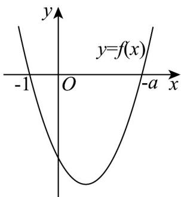

> [!faq]- 《高一数学上学期第一次月考（必修第一册第一章~第二章，高效培优·强化卷）》官方解析
>
> > [!success]- **【答案】** (1) $\left\{-1,0,3\right\}$ (2) $(-∞,0)$ (3) $\left[-\frac{1}{3}, +\infty\right)$
>
> > [!note]- **【解析】**
> > （1） $a = 3$ 时， $f(x) = x^2 + 4x + 3$
> >
> > 因为 $f(-1)=(-1)^{2}+4\times(-1)+3=0$ ， $f(-2)=(-2)^{2}+4\times(-2)+3=-1$
> >
> > $$
> > f (- 3) = (- 3) ^ {2} + 4 \times (- 3) + 3 = 0 \quad f (- 4) = (- 4) ^ {2} + 4 \times (- 4) + 3 = 3
> > $$
> >
> > 所以值域是 $\left\{-1,0,3\right\}$ .
> >
> > (2) $f(x) = x^{2} + (a + 1)x + a = (x + a)(x + 1)$ ，令 $f(x) = 0$ 得 $x = -a$ 或 $x = -1$
> >
> > 因为 $f(x)$ 的图象是开口向上的抛物线，
> >
> > 要使得关于 $x$ 的不等式 $f(x) < 0$ 有正数解，
> >
> > 
> >
> > 则要求 $-a > 0$ ，解得 a < 0，所以 a 的取值范围是 $(-∞, 0)$ .
> >
> > (3) $f(x) = x^{2} + (a + 1)x + a = (x + a)(x + 1)$ ，令 $f(x) = 0$ 得 $x = -a$ 或 $x = -1$
> >
> > 由 $3x - 1 \leq 0$ 得 $x \leq \frac{1}{3}$
> >
> > 要使得关于 $x$ 的不等式 $f(x) \leq 0$ 成立的任意一个 $x$ ，都满足不等式 $3x - 1 \leq 0$ ，
> >
> > 则 $\left\{x\mid (x + a)(x + 1)\leq 0\right\} \subseteq \left\{x\mid x\leq \frac{1}{3}\right\}$
> >
> > 当 $-a < -1$ 即 $a > 1$ 时，由 $f(x) \leq 0$ 得 $-a \leq x \leq -1$ ，所以 $\left\{x \mid -a \leq x \leq -1\right\} \subseteq \left\{x \mid x \leq \frac{1}{3}\right\}$ 成立，符合题意；
> >
> > 当 $-a = -1$ 即 $a = 1$ 时，由 $f(x) \leq 0$ 得 $x = -1$ ，所以 $\left\{-1\right\} \subseteq \left\{x \mid x \leq \frac{1}{3}\right\}$ 成立，符合题意；
> >
> > 当-a>-1 即 a<1 时，由 $f(x) \leq 0$ 得 $-1 \leq x \leq -a$
> >
> > 由 $\{x\mid -1\leq x\leq -a\} \subseteq \left\{x\Bigg|x\leq \frac{1}{3}\right\}$ 得 $a = -\frac{1}{3}$ ，所以 $-\frac{1}{3}\leq a <   1$
> >
> > 综上，a 的取值范围是 $\left[-\frac{1}{3}, +\infty\right)$ .
