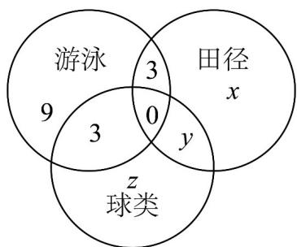

> [!faq]- 《高一数学上学期第一次月考（必修第一册第一章~第二章，高效培优·提升卷）》官方解析
>
> > [!success]- **【答案】** A.4个 B.3个 C.2个 D.1个
>
> > [!note]- **【解析】**
> > 对①：当 $a=b\neq0$ 时，有 $a-b=0\in G$ ，所以0是任何数域的元素，故①正确；
> >
> > 对②：取非0实数 $a\in G$ ，则 $\frac{a}{a} = 1\in G$ ，再由 $a,b\in G$ ，则 $a + b\in G$ ，可得任意正整数属于 $G$ ，故②正确；
> >
> > 对③：若 $P = \{x\mid x = 2k,k\in Z\}$ 为数域，取 $a = 2$ ， $b = 4$ ，则 $\frac{a}{b} = \frac{1}{2}\in P$ 不成立，故③错误；
> >
> > 对④：任取有理数 $x_{1}$ ， $x_{2}$ ，令 $a = x_{1}$ ， $b = x_{2}$ ，则 $a + b = (x_{1} + x_{2}) \in Q$ ， $a - b = (x_{1} - x_{2}) \in Q$
> >
> > $a \cdot b = (x_{1} \cdot x_{2}) \in Q$ ，且 $\frac{a}{b} = \frac{x_{1}}{x_{2}} \in Q (x_{2} \neq 0)$ ，所以有理数集 Q 是数域，故④正确.
> >
> > 所以正确的有：①②④.
> >
> > 故选：B.
> >
> > 4．学校举行运动会时，高一（1）班共有28名学生参加比赛，有15人参加游泳比赛，有8人参加田径比
> >
> > 赛，有14人参加球类比赛，同时参加游泳比赛和田径比赛的有3人，同时参加游泳比赛和球类比赛的有3
> >
> > 人，没有人同时参加三项比赛，同时参加田径比赛和球类比赛的有（）人
> > A. 5 B. 4 C. 3 D. 2
> >
> > 【答案】C
> >
> > 【详解】由题意，设只参加田径的人数为 x，同时参加田径和球类比赛的人数为 y
> >
> > 只参加球类的人数为 $z$ ，画出韦恩图，如图所示：
> >
> > 结合韦恩图，可得 $\left\{ \begin{array}{l}x + y + 3 = 8\\ y + z + 3 = 14\\ x + y + z + 15 = 28 \end{array} \right.$ ，解得 $x = 2,y = 3,z = 8$
> >
> > 所以同时参加田径比赛和球类比赛的有 3 人.
> >
> > 故选：C.
> >
> > 
