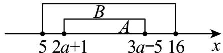

> [!faq]- 《专题01_集合热点题型突破_六大题型__高效培优期中专项训练_数学人教》官方解析
>
> > [!success]- **【答案】** A. $2 \leq a \leq 7$ B. $6 \leq a \leq 7$ C. $a \leq 7$ D. $a < 6$
>
> > [!note]- **【分析】**
> > 分情况讨论集合 A 是否为空集，再根据集合间的包含关系列出不等式组求解，最后综合两种情况得出 a 的取值范围.
>
> > [!note]- **【解析】**
> > 当 A 为空集时， $3a - 5 < 2a + 1$ 时·解不等式 $3a - 5 < 2a + 1$ ，可得 a < 6。
> >
> > 因为空集是任何集合的子集，所以当 a < 6 时， $A = \varnothing \subseteq B$ .
> >
> > 当 A 不为空集时， $3a-5$ $2a+1$ 时，解不等式 $3a-5$ $2a+1$ ，可得 a 6.
> >
> > 此时 $A \neq \varnothing$ ，要使 $A \subseteq B$ ，那么集合 A 中的元素都要满足集合 B 的范围。
> >
> > 
> >
> > 已知 $A = \{x\mid 2a + 1\leq x\leq 3a - 5\}$ ， $B = \{x\mid 5\leq x\leq 16\}$ ，所以需满足 $\left\{ \begin{array}{ll}3a - 5\leq 16\\ 2a + 1 & 5 \end{array} \right.$
> >
> > 解不等式 $3a - 5 \leq 16$ ，可得 $a = 2$ .
> >
> > 综合可得 $2 \leq a \leq 7$ ，又因为前提是 a 6，所以取交集得 $6 \leq a \leq 7$ 。
> >
> > 综合两种情况，将 $a < 6$ 和 $6 \leq a \leq 7$ 两种情况综合起来，取并集可得 $a \leq 7$
> >
> > 能使 $A \subseteq B$ 成立的所有 $a$ 组成的集合为 $\{a \mid a \leq 7\}$
> >
> > 故选 **C**.
