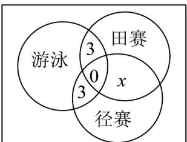

> [!faq]- 《专题01_集合热点题型突破_六大题型__高效培优期中专项训练_数学人教》官方解析
>
> > [!success]- **【答案】** (1) $A \cap B = \{x - 2 < x < 1\}$ (2) $a \in [-4, -1]$
>
> > [!note]- **【分析】**
> > （ $^{1}$ ）根据交集运算求解；
> >
> > (2) 根据子集关系列式运算得解·
>
> > [!note]- **【解析】**
> > （1）∵ $A = \{x \mid -4 < x < 1\}$ ， $B = \{x \mid -2 < x < 2\}$
> >
> > $$
> > \therefore A \cap B = \{x \mid - 2 <   x <   1 \}
> > $$
> >
> > (2) 因为 $a < a + 2$ 成立， $C^{1}$ $A E$ .
> >
> > 由 $C \subseteq A$ 得 $\left\{ \begin{array}{ll} a & -4 \\ a + 2 \leq 1 \end{array} \right.$ ，解得 $-4 \leq a \leq -1$
> >
> > 所以实数 a 的取值范围为 $[-4, -1]$ .
> >
> > ## 考点05韦恩图的实际应用
> >
> > 41. 学校举办秋季运动会时，高一（2）班共有 $^{24}$ 名同学参加比赛，有 $^{12}$ 人参加游泳比赛，有 $^{9}$ 人参加田赛，有 $^{13}$ 人参加径赛，同时参加游泳比赛和田赛的有 $^{3}$ 人，同时参加游泳比赛和径赛的有 $^{3}$ 人，没有人同时参加三项比赛，则同时参加田赛和径赛的有\_\_\_\_人。
> >
> > 【答案】4
> >
> > 【分析】设同时参加田赛和径赛的有 $x$ 人，由题意作出韦恩图，根据题意可得出关于 $x$ 的等式，即可得解
> >
> > 【详解】设同时参加田赛和径赛的有 $x$ 人，由题意作出韦恩图，
> >
> > 结合图形得：
> >
> > $$
> > 6 + 3 + 3 + x + (9 - 3 - x) + (1 3 - 3 - x) = 2 4
> > $$
> >
> > 解得 $x = 4$
> >
> > ∴同时参加田赛和径赛的有 $^{4}$ 人.
> >
> > 故答案为：4.
> >
> > 
> >
> > 42．高三 $^{1}$ 班有 $^{12}$ 名同学读过《牡丹亭》，有 $^{8}$ 名同学读过《醒世恒言》，两者都读过的同学有 $^{4}$ 名，则该班学生中至少读过《牡丹亭》和《醒世恒言》中的一本的学生有（）
> >
> > 【答案】
> > A. 16 人
> > B. 18 人
> > C. 20 人
> > D. 24 人
> >
> > 【答案】A
> >
> > 【分析】根据集合的容斥原理即可求解
> >
> > 【详解】设集合 $A =$ “高三 $^{1}$ 班读过《牡丹亭》的学生”，其元素个数记为 $\text{card}(A)$ ；集合 $B =$ “高三 $^{1}$ 班读过《醒世恒言》的学生”，其元素个数记为 $\text{card}(B)$ ；则 $\text{card}(A) = 12, \text{card}(B) = 8, \text{card}(A \cap B) = 4$ ，
> > 则 $\text{card}(A \cup B) = \text{card}(A) + \text{card}(B) - \text{card}(A \cap B) = 12 + 8 - 4 = 16$ .
> >
> > 故该班学生中至少读过《牡丹亭》和《醒世恒言》中的一本的学生有 $^{16}$ 人·
> >
> > 故选 **A**.
