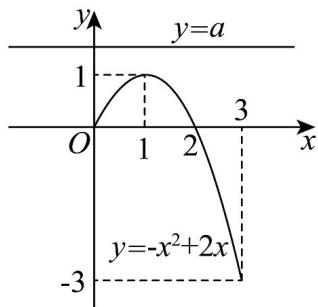

> [!faq]- 《专题03_不等式性质及一元二次考点总结_六大题型__高效培优期中专项训》官方解析
>
> > [!success]- **【答案】** A. $[-3,1]$ B. $(-∞,2]$ C. $[-7,-3) ∪ (1,2]$ D. $(-∞,-3) ∪ (1,2]$
>
> > [!note]- **【分析】**
> > 结合二次函数的单调性和一元二次不等式在某区间上恒成立问题求解即可；
>
> > [!note]- **【解析】**
> > 命题 p : $\exists x\in[0,3]$ ， $a=-x^{2}+2x$ 为假命题，
> >
> > $a = -x^{2} + 2x$ 在 $x \in [0,3]$ 上无解，
> >
> > 即 $y = a$ 与 $y = -x^{2} + 2x$ ， $x \in [0,3]$ 函数图象没有交点，
> >
> > 
> >
> > 由图可知：a > 1 或 a < -3，
> >
> > 命题 q : $\forall x\in[-1,2]$ ， $x^{2}+ax-8\leq0$ 为真命题，
> >
> > 则 $\left\{ \begin{array}{l} 1 - a - 8 \leq 0 \\ 4 + 2a - 8 \leq 0 \end{array} \right.$ ，解得 $-7 \leq a \leq 2$ ，
> >
> > 综上所述：实数 $a$ 的取值范围为 $[-7, -3) \cup (1, 2]$ .
> >
> > 故选 **C**.
