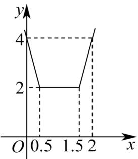

> [!faq]- 《专题05_函数值域考点总结_六大题型__高效培优期中专项训练_数学人教》官方解析
>
> > [!success]- **【答案】** $\left[\frac{1}{2},2\right]$
>
> > [!note]- **【分析】**
> > 函数 $f(x)$ 的表达式中含有绝对值，讨论去绝对值化成分段函数，结合函数图象求解
>
> > [!note]- **【解析】**
> > 由 $f(x)=|2x-1|+|2x-3|$
> >
> > 可得分段函数 $f(x) = \left\{ \begin{array}{ll} 4x - 4, & x = \frac{3}{2} \\ 2, & \frac{1}{2} < x < \frac{3}{2} \\ 4 - 4x, & x \leq \frac{1}{2} \end{array} \right.$
> >
> > 画出对应函数图象：
> >
> > 
> >
> > 的值域为，且
> >
> > $$
> > x \in [ 0, m ]
> > $$
> >
> > 所以 $m$ 的值能使得 $f(x)$ 取得最小值2；
> >
> > 由图可知： $m \in \left[\frac{1}{2}, 2\right]$ .
> >
> > 故答案为： $\left[\frac{1}{2},2\right]$
