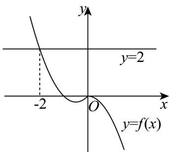

> [!faq]- 《专题05_函数值域考点总结_六大题型__高效培优期中专项训练_数学人教》官方解析
>
> > [!success]- **【答案】** $(-∞,√2]$
>
> > [!note]- **【分析】**
> > 利用分段函数解析式画出函数图象，解不等式即可求得结果·
>
> > [!note]- **【解析】**
> > 画出函数 $f(x)$ 的图象如下图所示：
> >
> > 
> >
> > 由 $f(f(a)) \leq 2$ 可得 $f(a) - 2$ ，
> >
> > 当 $a < 0$ 时， $f(a) = a^2 + a = \left(a + \frac{1}{2}\right)^2 - \frac{1}{4} - 2$ 恒成立；
> >
> > 当 $a$ 0时， $f(a) = -a^2 - 2$ ，解得 $0 \leq a \leq \sqrt{2}$ .
> >
> > 所以实数 a 的取值范围为 $\left(-\infty, \sqrt{2}\right]$ .
> >
> > 故答案为： $\left(-\infty ,\sqrt{2}\right]$
