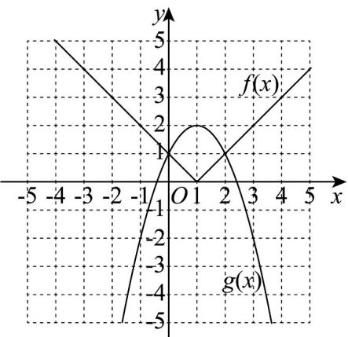
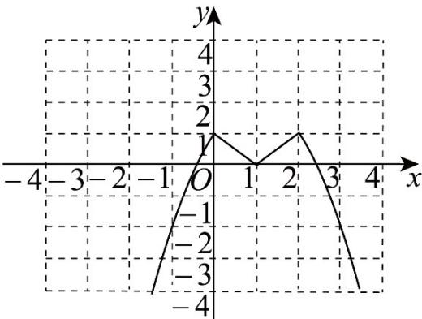

> [!faq]- 《专题05_函数值域考点总结_六大题型__高效培优期中专项训练_数学人教》官方解析
>
> > [!success]- **【答案】** (1)图象见解析 (2)答案见解析
>
> > [!note]- **【分析】**
> > （ $^{1}$ ）根据解析式直接作出解析式即可；
> >
> > (2) 根据 $h(x) = \min \left\{f(x), g(x)\right\}$ 的定义可得解析式和图象，结合图象可得单调区间和值域
>
> > [!note]- **【解析】**
> > （1） $f(x), g(x)$ 图象如下图所示，
> >
> > 
> >
> > (2) 令 $f(x) = g(x)$ ，即 $|x - 1| = -x^2 + 2x + 1$
> >
> > 当 x 1 时， $x-1=-x^{2}+2x+1$ ，解得：x=2；
> >
> > 当 x<1 时， $1-x=-x^{2}+2x+1$ ，解得：x=0；
> >
> > 则当 $x < 0$ 时， $g(x) < f(x)$ ；当 $0 < x < 2$ 时， $f(x) < g(x)$ ；当 $x > 2$ 时， $g(x) < f(x)$ ；
> >
> > $\therefore h(x) = \begin{cases} -x^2 + 2x + 1, & x < 0 \\ |x - 1|, & 0 \leq x \leq 2 \\ -x^2 + 2x + 1, & x > 2 \end{cases}$ ;
> >
> > 图象法表示 $h(x)$ 如下：
> >
> > 
> >
> > 由图象可知： $h(x)$ 的单调递增区间为 $(-∞,0)$ 和 $(1,2)$ ；单调递减区间为 $(0,1)$ 和 $(2,+∞)$ ，值域为 $(-∞,1]$ 。
