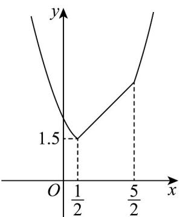

> [!faq]- 《专题05_函数值域考点总结_六大题型__高效培优期中专项训练_数学人教》官方解析
>
> > [!success]- **【答案】** $\frac{3}{2}$
>
> > [!note]- **【分析】**
> > 由题意画出 $f(x)$ 的图象，由图象可知当 $x = \frac{1}{2}$ 时，函数 $f(x)$ 有最小值求解即可·
>
> > [!note]- **【解析】**
> > 由题意画出 $f(x)$ 的图象：
> >
> > 
> >
> > 由图象可知当 $x=\frac{1}{2}$ 时， $f(x)_{\min}=\frac{1}{2}+1=\frac{3}{2}$ .
> >
> > 故答案为： $\frac{3}{2}$
