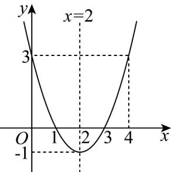

> [!faq]- 《专题05_函数值域考点总结_六大题型__高效培优期中专项训练_数学人教》官方解析
>
> > [!success]- **【答案】** AD
>
> > [!note]- **【分析】**
> > 先作出函数图象；再利用数形结合思想，注意区间端点，即可得出答案·
>
> > [!note]- **【解析】**
> > 先作出函数 $f(x) = x^{2} - 4x + 3$ 在 $R$ 上的图象，如图所示：
> >
> > 
> >
> > 结合函数图象可知当函数值域为 $[-1,3]$ 时，选项A、D正确·
> >
> > 故选 **AD**.
