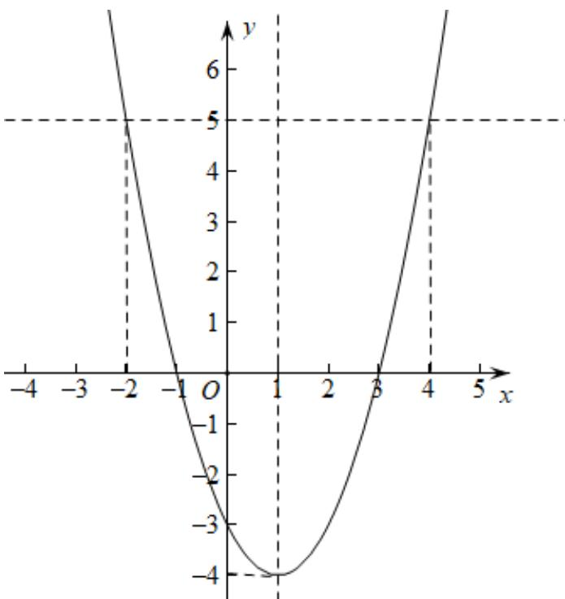

> [!faq]- 《专题05_函数值域考点总结_六大题型__高效培优期中专项训练_数学人教》官方解析
>
> > [!success]- **【答案】** ABC
>
> > [!note]- **【分析】**
> > 先画出 $f(x) = x^{2} - 2x - 3$ 的图象，再根据其值域为 $[-4,5]$ ，结合选项即可判断·
>
> > [!note]- **【解析】**
> > 解：画出 $f(x) = x^{2} - 2x - 3$ 的图象如图所示：
> >
> > 
> >
> > 由图可知： $f(-2)=f(4)=5$ $f(1)=-4$
> >
> > 根据选项可知：当 $f(x) = x^{2} - 2x - 3$ 的定义域为 $[a, b]$ ，值域为 $[-4, 5]$ 时，
> >
> > $(a,b)$ 的可能值为 $(-2,4)$ ， $(-2,1)$ ， $(1,4)$ .
> >
> > 故选 **ABC**.
