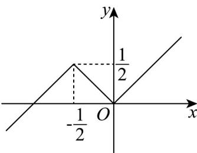

> [!faq]- 《专题07_函数单调性与奇偶性考点总结_八大题型__高效培优期中专项训练》官方解析
>
> > [!success]- **【答案】** BC
>
> > [!note]- **【分析】**
> > 根据题意作出 $m(x)$ 的函数图像，利用图像即可判断 ABD，先求 $|x| \leq \frac{1}{2}$ ，再利用图像即可解 $m(x) \leq \frac{1}{2}$ ，进而判断 C.
>
> > [!note]- **【解析】**
> > 作出函数 $m(x) = \min \{|x|, x + 1\}$ 的图象，如图：
> >
> > 
> >
> > 对于 $^{A}$ ：由图象可得 $m(x)$ 无最大值，无最小值，故 $^{A}$ 错误；
> >
> > 对于 $^{B}$ ：由图象可得，当 $x \leq 0$ 时， $m(x)$ 的最大值为 $\frac{1}{2}$ ，故 $^{B}$ 正确；
> >
> > 对于 $C$ ：由 $\left|x\right| \leq \frac{1}{2}$ ，解得 $-\frac{1}{2} \leq x \leq \frac{1}{2}$ ，由图象可得，不等式 $m(x) \leq \frac{1}{2}$ 的解集为 $\left(-\infty, \frac{1}{2}\right]$ ，故 $C$ 正确；
> > 对于 $D$ ：由图象可得， $m(x)$ 的单调递增区间为 $\left(-\infty, -\frac{1}{2}\right], [0, +\infty)$ ，故 $D$ 错误。
> >
> > $$
> > \mathrm{BC}.
> > $$
