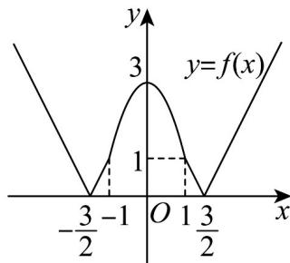

> [!faq]- 《专题07_函数单调性与奇偶性考点总结_八大题型__高效培优期中专项训练》官方解析
>
> > [!success]- **【答案】** C
>
> > [!note]- **【分析】**
> > 根据已知得到 $f(x) = \begin{cases} |2x + 3|, & x < -1 \\ 3 - 2x^2, & -1 \leq x \leq 1 \\ |2x - 3|, & x > 1 \end{cases}$ ，画出函数大致图象，数形结合判断A；根据时 $x \in [1,3]$ $x^2 - 4x + 3 \leq 0$ ，应用凑配法得到 $|2x - 3| < x$ 判断B；令 $f(x) = t$ ，则 $f(t) \leq 1$ 求 $t$ 范围，再结合解析式，应用分类讨论求解集，判断C；根据奇偶性， $x \in [-3, -2] \cup [2,3]$ 时 $m = f(x) \in [1,3]$ ，有 $f[f(x)] \leq f(x)$ 等价于
> >
> > $f(m)-m\leq0$ ，即可判断D.
>
> > [!note]- **【解析】**
> > 若 $\left|2x-3\right|=3-2x^{2}$ ，解得x=0或x=1，
> >
> > 结合二次函数和一次函数知 $g(x) = \begin{cases} |2x - 3|, & x \in (-\infty, 0) \cup (1, +\infty) \\ 3 - 2x^2, & x \in [0, 1] \end{cases}$
> >
> > 若 $\left|2x+3\right|=3-2x^{2}$ ，解得x=0或x=-1，
> >
> > 结合二次函数和一次函数知 $h(x) = \begin{cases} |2x + 3|, & x \in (-\infty, -1) \cup (0, +\infty) \\ 3 - 2x^2, & x \in [-1, 0] \end{cases}$
> >
> > 所以 $f(x) = \min \left\{g(x), h(x)\right\} = \begin{cases} |2x + 3|, & x < -1 \\ 3 - 2x^2, & -1 \leq x \leq 1 \\ |2x - 3|, & x > 1 \end{cases}$ ，
> >
> > 画出 $f(x)$ 的图象如下，
> >
> > 
> >
> > 结合图象及 $f(-x) = f(x)$ ，知 $f(x)$ 为偶函数，故 $\mathsf{A}$ 正确；
> >
> > 当 $x \in [1,3]$ 时 $x^{2} - 4x + 3 \leq 0$ ，即 $3x^{2} - 12x + 9 \leq 0$ ，所以 $4x^{2} - 12x + 9 \leq x^{2}$
> >
> > 所以 $|2x-3|<x$ ，所以 $f(x)\leq x$ 成立，故B正确；
> >
> > 对于 C，令 $f(x)=t$ ，则 $f(t)\leq1$ ，
> >
> > 当 $t < -1$ 时， $\left|2t + 3\right| \leq 1$ ，解得 $-2 \leq t < -1$ ，
> >
> > 当 $-1 \leq t \leq 1$ 时， $3 - 2t^2 \leq 1$ ，解得 $t \leq -1$ 或 $t - 1$ ，又 $-1 \leq t \leq 1$ ，所以 $t = \pm 1$ ，
> >
> > 当 $t > 1$ 时， $\left|2t - 3\right|\leq 1$ ，解得 $1 <   t\leq 2$
> >
> > 综上， $1\leq |t|\leq 2$ ，故 $1\leq \left|f(x)\right|\leq 2$
> >
> > 当 $x < -1$ 时， $1 \leq |2x + 3| \leq 2$ ，解得 $-\frac{5}{2} \leq x \leq -2$
> >
> > 当 $-1 \leq x \leq 1$ 时， $1 \leq 3 - 2x^2 \leq 2$ ，解得 $\frac{\sqrt{2}}{2} \leq x \leq 1$ 或 $-1 \leq t \leq -\frac{\sqrt{2}}{2}$ ，
> >
> > 当 $x > 1$ 时， $1 \leq |2x - 3| \leq 2$ ，解得 $2 \leq x \leq \frac{5}{2}$ ，
> >
> > 综上，不等式的解集为 $x \in \left[-1, -\frac{\sqrt{2}}{2}\right] \cup \left[\frac{\sqrt{2}}{2}, 1\right] \cup \left[2, \frac{5}{2}\right] \cup \left[-\frac{5}{2}, -2\right]$ ，故 $C$ 错误；
> >
> > 对于 D，当 $x \in [2,3]$ ，令 $m = f(x) = 2x - 3 \in [1,3]$ ，
> >
> > 结合偶函数的性质， $x\in [-3, - 2]\cup [2,3]$ 时 $m = f(x)\in [1,3]$ ，则 $f[f(x)]\leq f(x)$ 等价于 $f(m) - m\leq 0$
> >
> > 结合 B 分析，当 $x \in [-3, -2] \cup [2, 3]$ 时，有 $f[f(x)] \leq f(x)$ 成立，故 D 正确.
> >
> > 故选 **C**
