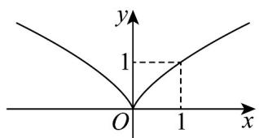

> [!faq]- 《专题08_幂函数考点总结_六大题型__高效培优期中专项训练_数学人教A》官方解析
>
> > [!success]- **【答案】** （1）作图见解析；（2） $(-∞,-2]∪[0,+∞)$ .
>
> > [!note]- **【分析】**
> > （1）结合幂函数的性质作出函数图象·
> >
> > (2) 利用幂函数的图象性质求解不等式·
>
> > [!note]- **【解析】**
> > （1）幂函数 $y = x^{\frac{2}{3}}$ 的定义域是 $^R$ ， $(-x)^{\frac{2}{3}} = \sqrt[3]{(-x)^2} = \sqrt[3]{x^2} = x^{\frac{2}{3}}$ ，函数 $y = x^{\frac{2}{3}}$ 是偶函数，其图象关于 $y$ 轴对称，在 $[0, +\infty)$ 上单调递增，
> >
> > 函数 $y = x^{\frac{2}{3}}$ 的图象，如图：
> >
> > 
> >
> > (2) 由 (1) 知，不等式 $(x - 1)^{\frac{2}{3}} \leq (2x + 1)^{\frac{2}{3}} \Leftrightarrow |x - 1|^{\frac{2}{3}} \leq |2x + 1|^{\frac{2}{3}} \Leftrightarrow |x - 1| \leq |2x + 1|$ ，
> >
> > 因此 $(x - 1)^{2} \leq (2x + 1)^{2}$ ，整理得 $3x^{2} + 6x = 0$ ，解得 $x \leq -2$ 或 $x = 0$ ，
> >
> > 所以原不等式的解集为 $(- \infty, -2] \cup [0, +\infty)$ .
> >
> > 46. 幂函数 $y = x^{2027}$ 的图象一定经过（）
> >
> > 【答案】
> >
> > A．第一、三象限 B．第二、四象限 C．第一、三象限和原点 D．第二、四象限和原点
> > 【答案】C
> >
> > 【分析】根据幂函数的解析式确定图象特征即可判断得解·
> >
> > 【详解】幂函数 $y = x^{2027}$ 是定义在 R 上的奇函数，其图象经过第一、三象限和原点·
> >
> > 故选 **C**
