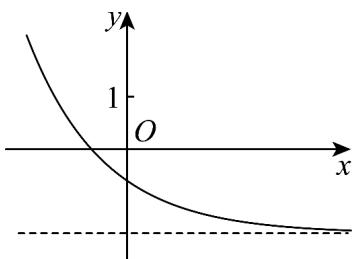

> [!faq]- 《专题10_指数函数考点大汇总_六大题型__高效培优期中专项训练_数学人》官方解析
>
> > [!success]- **【答案】**  A. $a > 1$ B. $b > 1$ C. $2^{b - a} < 1$ D. $g(x) = b^x -a$ 的图象不经过第四象限
>
> > [!note]- **【分析】**
> > 根据图象，结合指数函数的单调性，可得答案·
>
> > [!note]- **【解析】**
> > 对于 $^{A}$ ，由图象可知函数单调递减，则0<a<1，故 $^{A}$ 错误；
> >
> > 对于 B，当 x=0 时， $f(0)=a^{0}-b=1-b$ ，由图象可得 1-b<0，解得 b>1，故 B 正确；
> >
> > 对于 C，b-a>0，由 $y=2^{x}$ 是增函数，则 $2^{b-a}>2^{0}=1$ ，故 C 错误；
> >
> > 对于 $^{D}$ ，由b>1，0<a<1，则函数 $g(x)$ 是增函数，
> >
> > 当 $x = 0$ 时， $g(0) = b^0 - a = 1 - a > 0$ ，故 $\mathbb{D}$ 正确。
> >
> > 故选 **BD**.
