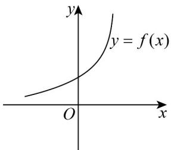
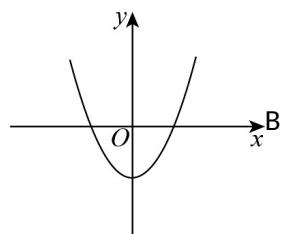

> [!faq]- 《专题10_指数函数考点大汇总_六大题型__高效培优期中专项训练_数学人》官方解析
>
> > [!success]- **【答案】**  A 
>
> > [!note]- **【分析】**
> > 由指数函数的图象特征，结合幂函数在第一象限的图象特征可得答案·
>
> > [!note]- **【解析】**
> > 根据题意可得 a > 1 ，
> >
> > $y = x^{a} + a$ 的图象是 $y = x^{a}$ 向上平移 $a$ 个单位得到的，
> >
> > 结合幂函数的性质可知 $y = x^{a} (a > 1)$ 在 $(0, +\infty)$ 上为单调递增函数，当 $a$ 为奇数时， $y = x^a + a$ 图象如 $\mathbb{C}$ 选项所示；当 $a$ 为偶数时， $y = x^a + a$ 图象如 $\mathbb{B}$ 选项所示，选项 $\mathbb{A}, \mathbb{D}$ 不符合题意。
> >
> > 故选：AD.
> >
> > ## 考点03 指数型函数过定点问题
