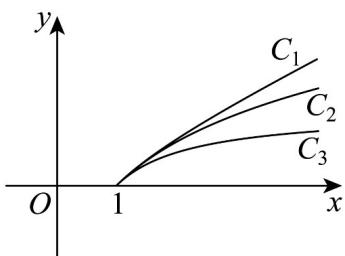

<!-- question-source:start -->
33. 已知 $x \quad 1$ ， $f(x) = \ln x$ ， $g(x) = 1 - \frac{1}{x}$ ， $h(x) = \frac{1}{2} \left( x - \frac{1}{x} \right)$ 三个函数图象如图所示，则 $f(x)$ ， $g(x)$

$h(x)$ 的图象依次为图中的（）

A. $C_1$ ， $C_2$ ， $C_3$ B. $C_3$ ， $C_2$ ， $C_1$ C. $C_2$ ， $C_3$ ， $C_1$ D. $C_1$ ， $C_3$ ， $C_2$
<!-- question-source:end -->

![[高中/课堂同步/题库/人教A版高中数学同步讲义(2026)/01_必修第一册/期中/专项训练/专题11_对数函数考点大汇总_八大题型__高效培优期中专项训练_数学人/_compact/answers/Q00066569A1.md]]
