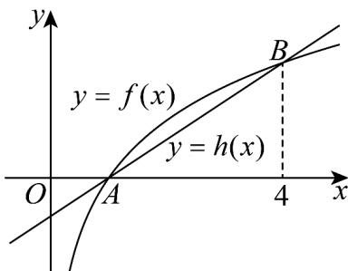

<!-- question-source:start -->
3. 如图，对数函数 $f(x)$ 的图象与一次函数 $h(x) = \frac{1}{3} x - \frac{1}{3}$ 的图象有 $A, B$ 两个公共点。

(1)求 $f(x)$ 的解析式；

(2)若关于 $x$ 的不等式 $4^{f(x)} < k$ 的解集中恰有1个整数解，求 $k$ 的取值范围.
<!-- question-source:end -->

![[高中/课堂同步/题库/人教A版高中数学同步讲义(2026)/01_必修第一册/期中/专项训练/专题11_对数函数考点大汇总_八大题型__高效培优期中专项训练_数学人/专题11_对数函数考点大汇总_六大题型_sec_01/questions/answers/Q00066544A1.md]]
