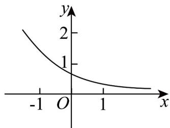

## 二十九．指数函数的图象与性质（共2小题）

57. 函数 $f(x) = a^{x} - b$ 的图象如图，其中 $a, b$ 为常数，则下列结论正确的是（）

【答案】

A. $a > 1, b < 0$ B. $a > 1, b > 0$ C. $0 < a < 1, b > 0$ D. $0 < a < 1, b < 0$

【答案】C

【分析】根据 $f(0)$ 判断b的范围，根据图象趋势判断a的范围即可.

【详解】由图象可知： $0 < f(0) = 1 - b < 1$ ， $\therefore 0 < b < 1$

又由函数 $f(x) = a^{x} - b$ 为减函数，可得 $0 < a < 1$

故选：C.

58. 不等式 $(x - \mathrm{e})(\mathrm{e}^x - 1) < 0$ （其中 $\mathrm{e}$ 为自然对数的底数）的解集是（）

【答案】

A. $\{x\mid 0 <   x <   1\}$ B. $\{x\mid 0 <   x <   e\}$

C. $\{x\mid x <   0$ 或 $x > 1\}$ D. $\{x\mid x <   0$ 或 $x > \mathrm{e}\}$

【答案】B

【分析】根据题意，不等式等价于 $\left\{\begin{aligned}x-e&>0\\ e^{x}&-1<0\end{aligned}\right.$ 或 $\left\{\begin{aligned}x-e&<0\\ e^{x}&-1>0\end{aligned}\right.$ ，再解不等式组即可.

【详解】由题知 $\left\{\begin{aligned}x-e&>0\\ e^{x}-1&<0\end{aligned}\right.$ 或 $\left\{\begin{aligned}x-e&<0\\ e^{x}&-1>0\end{aligned}\right.$

$$
\Rightarrow \left\{ \begin{array}{l l} x > \mathrm{e} \\ x <   0 \text {或} \end{array} \right. \left\{ \begin{array}{l l} x <   \mathrm{e} \\ x > 0 \end{array} \right.
$$

解得 $x \in \emptyset$ 或 $0 < x < e$

所以不等式的解集为 $\{x \mid 0 < x < e\}$

故选：B.
