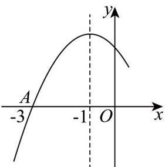
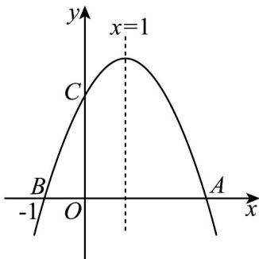

## 十三．二次函数的性质与图象（共2小题）

25．如图是二次函数 $y = ax^{2} + bx + c$ 图象的一部分，图象过点 $A(-3,0)$ ，对称轴为 x = -1，给出下面四个结

论，其中正确的是（）

A. $b^{2} > 4ac$ ； B. $2a - b = 1$ ；

C. $a - b + c = 0$ ； D.若 $y > 0$ ，则 $x\in (-3,1)$ 。

【答案】AD

【分析】根据二次函数的图象和性质，分析给定的四个结论是否正确.

【详解】由函数 $y = ax^{2} + bx + c$ 的图象，可得函数的图象开口向下，与 $x$ 轴有两个交点，

$\therefore a<0,\quad\Delta=b^{2}-4ac>0,\quad\therefore A正确;$

由对称轴方程为 $x = -\frac{b}{2a} = -1$ ，可得 $2a = b$ ， $\therefore 2a - b = 0$ ，∴B不正确；

由 $f(-1) > 0$ ，可得 $a - b + c > 0$ ， $\therefore \mathrm{C}$ 不正确；

由图象可得 $f(-3)=0$ ，根据函数的对称性，可得 $f(1)=0$ ，

由 y > 0 可得 -3 < x < 1，∴ D 正确.

故选：AD

26．如图所示，二次函数 $y = ax^{2} + bx + c(a \neq 0)$ 的图象与 $x$ 轴交于 $A$ ， $B$ 两点，与 $y$ 轴交于 $C$ 点，且对称轴

为 $x = 1$ ，点 $B$ 坐标为 $(-1,0)$ ，则下面结论中不正确的是（）

A. $2a + b = 0$

B. $b^{2} - 4ac <   0$

C. $cx^{2} + bx + a \leq 0$ 时的解集为 $\{x \mid x \leq -1 \text{ 或 } x \quad \frac{1}{3}\}$

D．方程 $ax^2 +bx + c = 4(a\neq 0)$ 有且仅有一个实数解

【答案】BCD

【分析】对于 A，由对称轴可判断；对于 B，由图象与 x 轴交于 A，B 两点即可判断；对于 C，由韦达定理得到 $b = -2a$ ， $c = -3a$ ，代入 $cx^2 +bx + a\leq 0$ 即可解不等式；对于D，将函数式设成 $y = k(x^{2} - 2x - 3)$ ，取 $k = 4$ ，由判别式判断.

【详解】对于 A，因为函数的对称轴为 x=1 ，所以 $-\frac{b}{2a}=1$ ，整理得 $2a+b=0$ 。故 A 正确；

对于 B，因为二次函数 $y = ax^{2} + bx + c (a \neq 0)$ 图象与 x 轴交于 A，B 两点，

所以 $b^{2} - 4ac > 0$ ，故B错误；

对于 C，因为二次函数的图象的对称轴为 x=1 ，点 B 坐标为 $(-1,0)$ ，所以点 A 的坐标为 $(3,0)$

所以-1和3是方程 $ax^{2}+bx+c=0(a<0)$ 的两根，

所以 $-\frac{b}{a}=2$ ， $\frac{c}{a}=-3$ ，

所以 b = -2a ， c = -3a ，

所以 $cx^2 + bx + a \leq 0$ 可化为 $-3ax^2 - 2ax + a \leq 0$

由于 $a < 0$ ，所以 $3x^{2} + 2x - 1 \leq 0$ ，解得 $-1 \leq x \leq \frac{1}{3}$ . 故C错误；

对于D，由C可设 $y = ax^{2} + bx + c = -k(x + 1)(x - 3) = -k(x^{2} - 2x - 3)$ ， $(k > 0)$

当 $k = 4$ 时，方程 $ax^2 + bx + c = 4$ 即为 $-k(x^2 - 2x - 3) = k$

所以 $x^{2}-2x-2=0$ ，

由于 $\Delta = 4 - 4 \times (-2) > 0$ ，此时方程有两个不等实数根，故 D 错误.

故选：BCD
