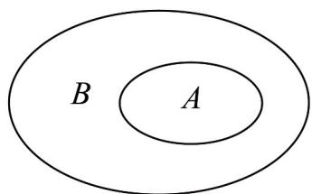

> [!faq]- 《专题01 集合热点题型突破（六大题型）（高效培优期中专项训练）数学人教A版2019高一必修第一册》官方解析
>
> > [!success]- **【答案】**  A. $a = 2$ B. $a < 2$ C. $a\leqslant 2$ D. $a > 2$
>
> > [!note]- **【分析】**
> > 解出集合 A，再根据 $A \subseteq B$ 求出 a 的取值范围.
>
> > [!note]- **【解析】**
> > 由题意可知 $A = \{1,2\}$ ，根据图示可知 $A\subseteq B$ ，所以 $a$ 的取值范围是 $a > 2$
> >
> > 故选 **D**
