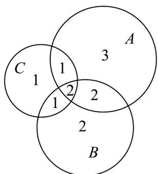

> [!faq]- 《专题01 集合热点题型突破（六大题型）（高效培优期中专项训练）数学人教A版2019高一必修第一册》官方解析
>
> > [!success]- **【答案】** A. 三项都参加的有 $^{1}$ 人 B. 只参加拔河的有 $^{3}$ 人 C. 只参加 $^{4}$ 人足球的有 $^{2}$ 人 D. 只参加羽毛球的有 $^{4}$ 人
>
> > [!note]- **【分析】**
> > 应用容斥原理求出三项都参加的同学人数，即可得答案·
>
> > [!note]- **【解析】**
> > 根据题意，设 $A=\{x \mid x$ 是参加拔河的同学 $\}$ ， $B=\{x \mid x$ 是参加 4 人足球的同学 $\}$ ， $C=\{x \mid x$ 是参加羽毛球的同学 $\}$ ，
> > 则 $\operatorname{card}(A)=8,\quad\operatorname{card}(B)=7,\quad\operatorname{card}(C)=5$ 又 $\operatorname{card}(A\cap B)=4,\quad\operatorname{card}(A\cap C)=\operatorname{card}(B\cap C)=3$ 所以 $\operatorname{card}(A\cap B\cap C)=12-\left[(8+7+5)-(4+3+3)\right]=2$
> >
> > 
> >
> > 所以三项比赛都参加的有 $^{2}$ 人，只参加拔河的有 $^{3}$ 人，只参加 $^{4}$ 人足球的有 $^{2}$ 人，只参加羽毛球的有 $^{1}$ 人。
> >
> > 故选 **BC**
