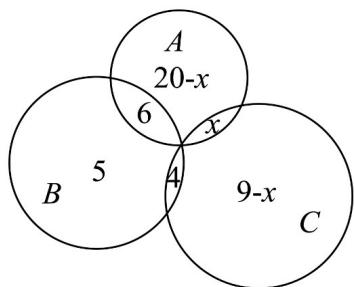

> [!faq]- 《专题01 集合热点题型突破（六大题型）（高效培优期中专项训练）数学人教A版2019高一必修第一册》官方解析
>
> > [!success]- **【答案】** C
>
> > [!note]- **【分析】**
> > 由题意，根据容斥原理，结合集合的运算即可求解·
>
> > [!note]- **【解析】**
> > 设心理社为 A，地理社为 B，动漫社为 C，
> > 则 $\text{card}(A \cup B \cup C) = 35, \text{card}(A \cap B \cap C) = 0$ ， $\text{card}(A)=19,\text{card}(B)=16,\text{card}(C)=15,\text{card}(A\cap B)=6,\text{card}(B\cap C)=5$ 得 $\text{card}(A\cup B\cup C)=\text{card}(A)+\text{card}(B)+\text{card}(C)-\text{card}(A\cap B)-\text{card}(B\cap C)-\text{card}(A\cap C)-\text{card}(A\cap B\cap C)$ 即 $35=19+16+15-6-5-\text{card}(A\cap C)$ ，得 $\text{card}(A\cap C)=4$ 所以只参加一个社团的人数共有 $19-(4+6)+16-(6+5)+15-(4+5)=20$
> >
> > 故选：C
> >
> > 45. 学校举办运动会时，高一（1）班共有36名同学参加比赛，有26人参加游泳比赛，有15人参加田径比赛，有13人参加球类比赛，同时参加游泳比赛和田径比赛的有6人，同时参加田径比赛和球类比赛的有4人，没有人同时参加三项比赛·同时参加游泳和球类比赛的有\_\_\_\_人·
> >
> > 【答案】8
> >
> > 【分析】设高一（1）班参加游泳、田径、球类比赛的学生分别构成集合 $A$ 、 $B$ 、 $C$ ，设同时参加游泳和球类比赛的学生人数为 $x$ 人，作出韦恩图，根据题意可得出关于 $x$ 的方程，解出 $x$ 的值即可·
> >
> > 【详解】设高一（1）班参加游泳、田径、球类比赛的学生分别构成集合 A、B、C
> >
> > 设同时参加游泳和球类比赛的学生人数为 x 人，由题意作出如下韦恩图，
> >
> > 
> >
> > 由题意可得 $26 + 5 + 4 + 9 - x = 44 - x = 36$ ，解得 x = 8。
> >
> > 因此，同时参加游泳和球类比赛的有8人·
> >
> > 故答案为：8·
