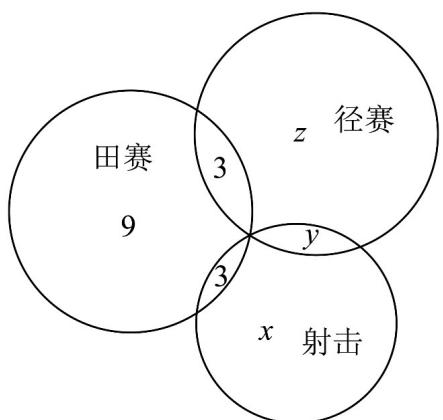

> [!faq]- 《专题01 集合热点题型突破（六大题型）（高效培优期中专项训练）数学人教A版2019高一必修第一册》官方解析
>
> > [!success]- **【答案】** A. 4名 B. 6名 C. 8名 D. 10名
>
> > [!note]- **【分析】**
> > 由集合的运算即可得出结果·
>
> > [!note]- **【解析】**
> > 因为高一（1）班有40名同学，其中25名同学参加了体育活动，15名同学参加了科学活动，有
> >
> > $^{10}$ 名同学这两个课余活动均没参加，
> >
> > 所以这个班既参加了体育活动，又参加了科学活动的同学有 $25 + 15 + 10 - 40 = 10$ 名.
> >
> > 故选：D.
> >
> > 48. 广州奥林匹克中学第 5 届（总第 35 届）学校运动会于 2024 年 11 月 7 日至 8 日在车陂路校区和智谷校区同时举行，本届校运会，初中新增射击比赛项目，初一某班共有 28 名学生参加比赛，其中有 15 人参加田赛比赛，有 14 人参加径赛比赛，有 8 人参加射击比赛，同时参加田赛和射击比赛的有 3 人，同时参加田赛和径赛比赛的有 3 人，没有人同时参加三项比赛，只参加一项比赛的有（）人·
> > A. 3 B. 9 C. 19 D. 14
> >
> > 【答案】C
> >
> > 【分析】画出韦恩图求解即可·
> >
> > 【详解】解：设只参加射击的人数为 $x$ ，同时参加射击和径赛比赛的人数为 $y$ ，只参加径赛的人数为 $z$ ，作出韦恩图，如图所示：
> >
> > 
> >
> > 则由韦恩图得：
> >
> > $\left\{ \begin{array}{l}x + y + 3 = 8\\ y + z + 3 = 14\\ x + y + z + 15 = 28 \end{array} \right.$ ，解得 $\left\{ \begin{array}{l}x = 2\\ y = 3\\ z = 8 \end{array} \right.,$
> >
> > 所以只参加一项比赛的有 $x + z + 9 = 19$ 人·
> >
> > 故选 **C**.
