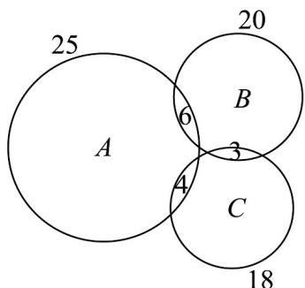

> [!faq]- 《专题01 集合热点题型突破（六大题型）（高效培优期中专项训练）数学人教A版2019高一必修第一册》官方解析
>
> > [!success]- **【答案】** A．三项比赛都参加的有 $^{2}$ 人 B．只参加 100 米比赛的有 $^{3}$ 人 C．只参加 400 米比赛的有 $^{3}$ 人 D．只参加 1500 米比赛的有 $^{3}$ 人
>
> > [!note]- **【分析】**
> > 由题意先分析出 $^{3}$ 项都参加的人数，再分析只参加某项的人数即可。
>
> > [!note]- **【解析】**
> > 根据题意，设 $A=\{x|x$ 是参加 100 米的同学， $B=\{x|x$ 是参加 400 米的同学， $C=\{x|x$ 是参加 1500 米的同学，
> > 则 $\text{card}(A)=8, \text{card}(B)=7, \text{card}(C)=5,$ 且 $\text{card}(A\cap B)=4,\text{card}(A\cap C)=3,\text{card}(B\cap C)=3,$ 则 $\text{card}(A\cap B\cap C)=12-\left[(8+7+5)-(4+3+3)\right]=2$ 所以三项比赛都参加的有 $^{2}$ 人，
> > 只参加100米比赛的有8-4-3+2=3人，
> > 只参加400米比赛的有7-4-3+2=2人，
> > 只参加1500米比赛的有5-3-3+2=1人.
> > 故选：AB
> >
> > 50．“运动改造大脑”，为了增强身体素质，某班学生积极参加学校组织的体育特色课堂，课堂分为球类项目 A、径赛项目 B、其他健身项目 C。该班有 25 名同学选择球类项目 A，20 名同学选择径赛项目 B，18 名同学选择其他健身项目 C；其中有 6 名同学同时选择 A 和 B，4 名同学同时选择 A 和 C，3 名同学同时选择 B 和 C。若全班同学每人至少选择一类项目且没有同学同时选择三类项目，则这个班同学人数是（）
> >
> > 【答案】B
> > 【分析】根据题意，结合venn图，列式运算得解·
> > 【详解】
> >
> > 
> >
> > 由题意， $\operatorname{card}(A) = 25$ ， $\operatorname{card}(B) = 20$ ， $\operatorname{card}(C) = 18$ ， $\operatorname{card}(A \cap B) = 6$
> >
> > $$
> > \operatorname{card} (A \cap C) = 4 \quad \operatorname{card} (B \cap C) = 3
> > $$
> >
> > 因为全班同学每人至少选择一类项目且没有同学同时选择三类项目，
> >
> > 所以这个班同学人数是
> >
> > $$
> > \operatorname{card} (A \cup B \cup C) = \operatorname{card} (A) + \operatorname{card} (B) + \operatorname{card} (C) - \operatorname{card} (A \cap B) - \operatorname{card} (A \cap C) - \operatorname{card} (B \cap C)
> > $$
> >
> > $$
> > = 2 5 + 2 0 + 1 8 - 6 - 4 - 3 = 5 0.
> > $$
> >
> > 故选：B.
> >
> > ## 考点 06 充分必要条件及求参
