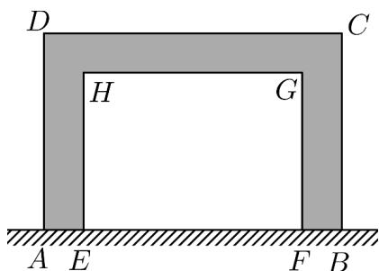

> [!faq]- 《专题04+函数定义域考点总结（六大题型）（高效培优期中专项训练）数学人教A版2019高一必修第一册》官方解析
>
> > [!success]- **【答案】** A. $\left[\frac{1}{2},\frac{3}{2}\right]$ B. $\left[\frac{1}{2},1\right)\cup \left(1,\frac{3}{2}\right]$ C. $\{2,4,6\}$ D. $\left\{\frac{1}{2},\frac{3}{2}\right\}$
>
> > [!note]- **【分析】**
> > 根据函数定义域的概念计算即可·
>
> > [!note]- **【解析】**
> > 由题意可知 $f(2x)$ 有意义需要 $2x \in \{1,2,3\} \Rightarrow x \in \left\{\frac{1}{2}, 1, \frac{3}{2}\right\}$
> >
> > 又 $x - 1 \neq 0 \Rightarrow x \neq 1$
> >
> > 所以函数 $y=\frac{f(2x)}{x-1}$ 的定义域是 $\left\{\frac{1}{2},\frac{3}{2}\right\}$ .
> >
> > 故选：D
> >
> > ## 考点04 实际问题定义域
> >
> > 31. 为了增强生物实验课的趣味性，丰富生物实验教学内容，某校计划沿着围墙（足够长）划出一块面积为 $100$ 平方米的矩形区域 $ABCD$ 修建一个羊驼养殖场，规定 $ABCD$ 的每条边长均不超过 $20$ 米·如图所示，矩形 $EFGH$ 为羊驼养殖区，且点 $A, B, E, F$ 四点共线，阴影部分为 $^{1}$ 米宽的鹅卵石小径·设 $AB = x$ （单位：米），养殖区域 $EFGH$ 的面积为 $S$ （单位：平方米）·
> >
> > 
> >
> > (1)将 $\mathrm{S}$ 表示为 $x$ 的函数，并写出 $x$ 的取值范围；
> >
> > (2)当 $AB$ 为多长时，S取得最大值？并求出最大值·
> >
> > 【答案】(1) $S=102-x-\frac{200}{x}$ ， $5\leq x\leq20$
> >
> > (2)当 $AB$ 为 $10\sqrt{2}$ 时，S取得最大值，最大值为 $102 - 20\sqrt{2}$
> >
> > 【分析】（1）根据题意表示出 $EFGH$ 的面积，并根据 $ABCD$ 的每条边长均不超过 $^{20}$ 米确定好 $x$ 的取值范围·
> >
> > (2) 对 (1) 中的结果，利用基本不等式求最大值.
> >
> > 【详解】（1）因为 $AB = x$ ，所以 $AD = \frac{100}{x}$ ， $FG = \frac{100}{x} - 1$ ， $EF = x - 2$ $S = (x - 2)\left(\frac{100}{x} -1\right) = 102 - x - \frac{200}{x}$ 因为 $0 <   x\leq 20$ ， $0 <   \frac{100}{x}\leq 20$ ，所以 $5\leq x\leq 20$ ：
> > (2） $S = (x - 2)\left(\frac{100}{x} -1\right) = 102 - x - \frac{200}{x}$ $\leq 102 - 2\sqrt{x\cdot\frac{200}{x}} = 102 - 20\sqrt{2}$ 当且仅当 $x = \frac{200}{x}$ ，即 $x = 10\sqrt{2}$ 时，等号成立，
> > 所以当 $AB$ 为 $10\sqrt{2}$ 时，S取得最大值，最大值为 $102 - 20\sqrt{2}$
> >
> > 32. 一枚炮弹发射后，经过 $26\mathrm{s}$ 落到地面击中目标。炮弹的射高为 $845\mathrm{m}$ ，且炮弹距地面的高度 $h$ （单位： $\mathrm{m}$ ）与时间 $t$ （单位： $\mathrm{s}$ ）的关系为 $h = 130t - 5t^2$ 。该函数定义域为（ ）A. $(0, +\infty)$ B. $(0,845]$ C. $[0,26]$ D. $[0,845]$
> >
> > 【答案】C
> >
> > 【分析】根据实际意义分析即可·
> >
> > 【详解】由题意可知，炮弹发射后共飞行了26s
> >
> > 所以 $0 \leq t \leq 26$ ，即函数 $h = 130t - 5t^{2}$ 的定义域为 $[0, 26]$ .
> >
> > 故选：C
> >
> > 33. 为应对疫情需要，某医院需要临时搭建一处面积为 $10000$ 平方米的矩形隔离病区（图中大矩形），划分两个完全相同的长方形工作区域（图中两小矩形），分别为观察区和治疗区，根据防疫要求，为方便救护车出入所有内部通道（图中阴影区域）的宽度为 $6$ 米·
> >
> > <table><tr><td>观察区</td><td>治疗区</td></tr></table>
> >
> > (1)设隔离病区的长 $x$ 米，将工作区的面积表示为 $x$ 的函数 $f(x)$ ，并求出定义域
> >
> > (2)应该如何设计该隔离病区的长，才能使工作区域的总面积最大？
> >
> > 【答案】(1) $f(x)=-12x-\frac{180000}{x}+10216$ ，定义域为 $\left\{x\mid18<x<\frac{2500}{3}\right\}$ ;
> >
> > (2) $50 \sqrt{6}$ 米时面积最大
> >
> > 【分析】（ $^{1}$ ）根据题意，列出关系式即可；（ $^{2}$ ）根据基本不等式，即可求出最值·
> >
> > 【详解】（1）设隔离病区的长为 $x$ 米，由面积为 $10000$ 平方米，得宽为 $\frac{10000}{x}$ 米，
> >
> > 由题意知， $\left\{\begin{aligned}\frac{10000}{x}-12>0\\ x-18>0\end{aligned}\right.$ ，解得 $18<x<\frac{2500}{3}$ ，
> >
> > 所以， $f(x)=\left(\frac{10000}{x}-12\right)(x-18)=-12x-\frac{180000}{x}+10216$
> >
> > 定义域为 $\left\{x \mid 18 < x < \frac{2500}{3}\right\}$
> >
> > (2) 由 (1) 知， $f(x) = -12x - \frac{180000}{x} + 10216 = -12\left(x + \frac{15000}{x}\right) + 10260$
> >
> > $$
> > \leq - 1 2 \times 2 \sqrt {x \cdot \frac {1 5 0 0 0}{x}} + 1 0 2 1 6 = 1 0 2 1 6 - 1 2 0 0 \sqrt {6},
> > $$
> >
> > 当且仅当， $x = \frac{15000}{x}$ ，即 $x = 50\sqrt{6}$ 时，等号成立·
> >
> > 所以，当该隔离病区的长为 $50 \sqrt{6}$ ，才能使工作区域的总面积最大。
