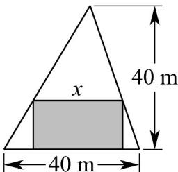

> [!faq]- 《专题04+函数定义域考点总结（六大题型）（高效培优期中专项训练）数学人教A版2019高一必修第一册》官方解析
>
> > [!success]- **【答案】** 
>
> > [!note]- **【分析】**
> > 由三角形相似得 $x + y = 40$ ，再根据面积不小于 $336\mathrm{m}^2$ ，即可求得 $x$ 的取值范围
>
> > [!note]- **【解析】**
> > 设矩形另一边的长为 $y \mathrm{~m}$
> >
> > 由三角形相似得： $\frac{x}{40}=\frac{40-y}{40}$ ，（0<x<40,0<y<40），
> >
> > 所以 $x + y = 40$ ，
> >
> > 所以矩形草坪的面积 $S = xy = x(40 - x)$ 336
> >
> > 解得： $12 \leq x \leq 28$
> >
> > 故答案为： $\{x|12\leq x\leq 28\}$
