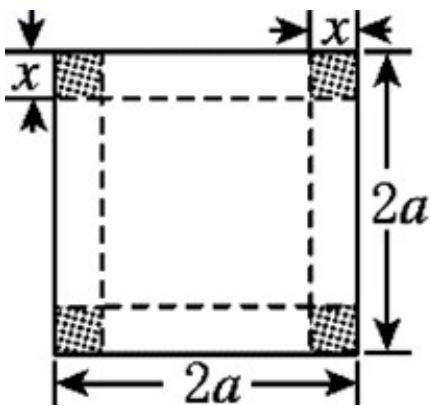
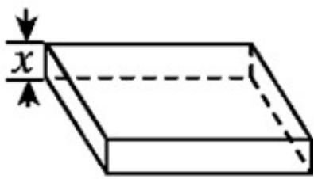

> [!faq]- 《专题04+函数定义域考点总结（六大题型）（高效培优期中专项训练）数学人教A版2019高一必修第一册》官方解析
>
> > [!success]- **【答案】** D
>
> > [!note]- **【分析】**
> > 根据三角形三边为正、两边之和大于第三边，列出关于 $x$ 的不等式组，解出即可·
>
> > [!note]- **【解析】**
> > 由题意知 $\left\{ \begin{array}{l} x > 0, \\ 10 - 2x > 0, \\ 2x > 10 - 2x, \end{array} \right.$ 解得 $\frac{5}{2} < x < 5$ 即定义域为 $\left\{ x \mid \frac{5}{2} < x < 5 \right\}$ .
> >
> > 故选 **D**.
>
> > [!tip]- **【名师点睛】**
> > 本题结合三角形三边的关系可查函数的定义域，属于基础题·
> >
> > 常考函数的定义域：① $\left[f(x)\right]^{0}\Rightarrow f(x)\neq0$ ；
> > - **②**：$\frac{1}{f(x)}\Rightarrow f(x)\neq0$ ；
> > - **③**：$\sqrt{f(x)}\Rightarrow f(x)\quad0$ ；
> > - **④**：$\log_{a}f(x)\Rightarrow f(x)>0$ ；
> > - **⑤**：$\tan f(x)\Rightarrow f(x)\neq\frac{\pi}{2}+k\pi,k\in Z$ ；
> > - **⑥**：实际问题中，需根据实际问题限制范围·38．从边长为 $^{2a}$ 的正方形铁片的四个角各裁去一个边长为x的正方形，然后折成一个无盖的长方体盒子，要求长方体的高度x与底面正方形边长的比不超过正常数t．试把铁盒的容积V表示为x的函数，并求出其定义域．
> >
> > 
> >
> > 
> >
> > 【答案】 $V=4x^{3}-8ax^{2}+4a^{2}x$ ， $\left\{x\mid0<x\leq\frac{2at}{1+2t}\right\}$
> >
> > 【解析】由长方体铁盒高为 $x$ ，底面正方形的边长为 $2a - 2x$ ，则 $V = (2a - 2x)^{2}x$ ，并由实际意义可得 $\left\{ \begin{array}{l}0 < x < a\\ \frac{x}{2a - 2x}\leq t \end{array} \right.$ 进而求解即可得到定义域
> >
> > 【详解】解：依题意知，长方体铁盒高为 $x$ ，底面正方形的边长为 $2a - 2x$ ，则
> >
> > $$
> > V = (2 a - 2 x) ^ {2} x = 4 x (a - x) ^ {2} = 4 x ^ {3} - 8 a x ^ {2} + 4 a ^ {2} x,
> > $$
> >
> > $$
> > \because \left\{ \begin{array}{l} 0 <   x <   a \\ \frac {x}{2 a - 2 x} \leq t \end{array} , \therefore \left\{ \begin{array}{l} 0 <   x <   a \\ 0 <   x \leq \frac {2 a t}{1 + 2 t} \end{array} , \right. \right.
> > $$
> >
> > $$
> > \because a - \frac {2 a t}{1 + 2 t} = \frac {a}{1 + 2 t} > 0, \therefore 0 <   x \leq \frac {2 a t}{1 + 2 t},
> > $$
> >
> > 故铁盒的容积 $V = 4x^{3} - 8ax^{2} + 4a^{2}x$ 定义域为 $\left\{x\mid 0 <   x\leq \frac{2at}{1 + 2t}\right\}$
> >
> > 39. 周长为定值 $a$ 的矩形，它的面积 $S$ 是这个矩形的一边长 $x$ 的函数，则这个函数的定义域是（）A. $(a, +\infty)$ B. $\left(\frac{a}{2}, +\infty\right)$ C. $\left(\frac{a}{2}, a\right)$ D. $\left(0, \frac{a}{2}\right)$
> >
> > 【答案】D
> >
> > 【解析】设矩形的一边长为 $x$ ，该边的邻边长为 $\frac{a - 2x}{2} = \frac{a}{2} - x$ ，根据矩形的边长大于零即可求解。【详解】依题意知，矩形的一边长为 $x$ ，则该边的邻边长为 $\frac{a - 2x}{2} = \frac{a}{2} - x$ ，
> >
> > 由 $\left\{ \begin{array}{l} x > 0 \\ \frac{a}{2} - x > 0 \end{array} \right.$ 得 $0 < x < \frac{a}{2}$ ，故这个函数的定义域是 $\left(0, \frac{a}{2}\right)$ .
> >
> > 故选：D
