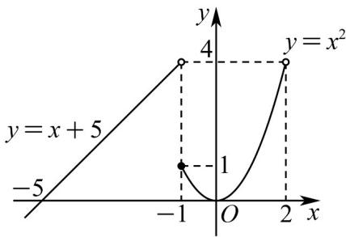

> [!faq]- 《专题04+函数定义域考点总结（六大题型）（高效培优期中专项训练）数学人教A版2019高一必修第一册》官方解析
>
> > [!success]- **【答案】** BC
>
> > [!note]- **【分析】**
> > 根据分段函数解析式可得到其定义域，判断 A 选项，分别在各自自变量范围内，求解其函数范围最后取其并集，为最终值域，即可判断 B 选项，将 x = -1 代入 $f(x) = x^{2}$ ，可判断 C，在各自范围内，令其等于 3，得到 $x + 5 = 3$ 或 $x^{2} = 3$ ，即可判断 D 选项.
>
> > [!note]- **【解析】**
> > 由分段函数解析式可知其定义域为 $(-∞,2)$ ，故A错误；
> >
> > 当 $x < -1$ 时，此时 $f(x) = x + 5$ ，在 $(- \infty, -1)$ 上单调递增，则此时 $f(x) < f(-1) = 4$
> >
> > 当 $-1 \leq x < 2$ 时，此时 $f(x) = x^2$ ，对称轴为 $x = 0$ ，则 $f(x)_{\min} = f(0) = 0$ ，且 $f(x) < f(2) = 4$ ，故此时
> >
> > $0 \leq f(x) < 4$
> >
> > 故 $f(x)$ 值域为 $(-∞,4)$ ，作出如图所示图象，故 $^{B}$ 正确；
> >
> > 
> >
> > ，故 $^{C}$ 正确，
> >
> > $$
> > f (- 1) = (- 1) ^ {2} = 1
> > $$
> >
> > 当 $x < -1$ 时， $3 = x + 5$ ， $x = -2$ ；当 $-1 \leq x < 2$ 时， $3 = x^2$ ， $x = \sqrt{3}$ （舍去另一个负值），
> >
> > 故若 $f(x) = 3$ ，则 $x$ 的值是 $\sqrt{3}$ 或-2，故D错误；
> >
> > 故选 **BC**.
