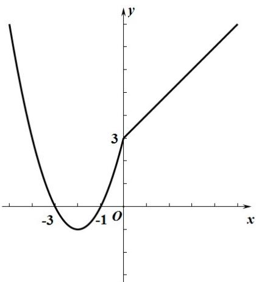

> [!faq]- 《专题04+函数定义域考点总结（六大题型）（高效培优期中专项训练）数学人教A版2019高一必修第一册》官方解析
>
> > [!success]- **【答案】** (1) $f(x)=\left\{\begin{aligned}x^{2}+4x+3,x&<0\\ x+3,x&0\end{aligned}\right.$ (2)定义域 $R$ ，值域 $\left[-1, +\infty\right)$ .
>
> > [!note]- **【分析】**
> > （1）根据条件列方程组求解析式；（2）画出图象得到性质·
>
> > [!note]- **【解析】**
> > （1）由 $f(-4) = f(0)$ ，得 $16 - 4b + c = 3$
> >
> > 由 $f(-1) = 0$ ，得 $1 - b + c = 0$
> >
> > 联立解方程得： $b = 4$ ， $c = 3$
> >
> > 所以 $f(x)=\left\{\begin{aligned}x^{2}+4x+3,x<0\\ x+3,x&0\end{aligned}\right.$
> >
> > (2) 函数图像如图所示：
> >
> > 
> >
> > 定义域为：R，值域为： $\left[-1,+\infty\right)$
> >
> > 函数的单调递增区间为： $(-2, + \infty)$
> >
> > 单调递减区间为： $(-∞,-2)$ .
