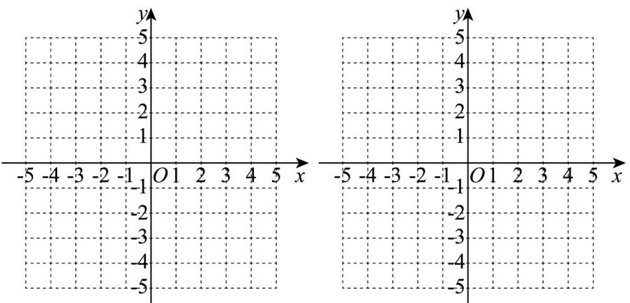

<!-- question-source:start -->
35. 已知函数 $f(x) = |x - 1|, g(x) = -x^2 + 2x + 1$ .

(1)在同一坐标系中画出函数 $f(x), g(x)$ 的图象；

(2)定义：对 $\forall x\in \mathrm{R},h(x)$ 表示 $f(x)$ 与 $g(x)$ 中的较小者，记为 $h(x) = \min \{f(x),g(x)\}$ ，画函数 $h(x)$ 的图象，并求函数 $h(x)$ 的解析式，写出 $h(x)$ 的单调区间和值域（不需要证明）.
<!-- question-source:end -->

![[高中/课堂同步/题库/人教A版高中数学同步讲义(2026)/01_必修第一册/期中/专题05+函数值域考点总结（六大题型）（高效培优期中专项训练）数学人教A版2019高一必修第一册/_compact/answers/Q00072715A1.md]]
