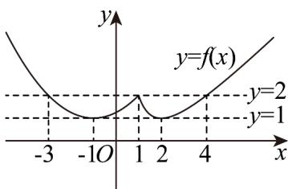

> [!faq]- 《专题05+函数值域考点总结（六大题型）（高效培优期中专项训练）数学人教A版2019高一必修第一册》官方解析
>
> > [!success]- **【答案】** C
>
> > [!note]- **【分析】**
> > 画出 $f(x)$ 的图象，根据题意，数形结合，即可求得问题·
>
> > [!note]- **【解析】**
> > 根据题意，作出 $y = f(x)$ 的图象如下所示：
> >
> > 
> >
> > 数形结合可知，要使 $y = f(x)$ 的值域为[1,2]，且 $n - m$ 取得最大值，
> >
> > 则只需 m = -3 ， n = 4 即可，故 n - m 的最大值为 7 .
> >
> > 故选 **C**.
