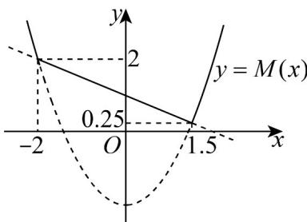

> [!faq]- 《专题05+函数值域考点总结（六大题型）（高效培优期中专项训练）数学人教A版2019高一必修第一册》官方解析
>
> > [!success]- **【答案】** (1)1 (2)R (3) $\left[-2, -\frac{1}{2}\right]$
>
> > [!note]- **【分析】**
> > （ $^{1}$ ）根据题意直接代入运算求解即可；
> >
> > (2) 根据函数单调性，分别分析 $f(x)$ 在 $(- \infty, 1]$ 和 $(1, +\infty)$ 内的值域，再取并集；
> >
> > (3) 根据分段函数单调性列式求解即可，注意端点值的大小关系·
>
> > [!note]- **【解析】**
> > （1）因为 $f(x) = \begin{cases} 2ax + 3, & x \leq 1 \\ ax^2 + x, & x > 1 \end{cases}$ ，
> >
> > 则 $f(1) = 2a + 3 = 5$ ，解得 $a = 1\cdot$
> >
> > (2) 因为 $f(x)=\left\{\begin{aligned}&2ax+3,x\leq1\\ &ax^{2}+x,x>1\end{aligned}\right.$ ，且 a>0，
> >
> > 可知 $f(x) = 2ax + 3$ 在 $(- \infty, 1]$ 内单调递增，则 $f(x) \leq f(1) = 2a + 3$
> >
> > 所以 $f(x)$ 在 $(-∞,1]$ 内的值域为 $(-∞,2a+3]$ ;
> >
> > 且 $f(x) = ax^{2} + x$ 在 $(1, +\infty)$ 内单调递增，则 $f(x) > f(1) = a + 1$
> >
> > 所以 $f(x)$ 在 $(1,+\infty)$ 内的值域为 $(a+1,+\infty)$ ;
> >
> > 注意到 $2a + 3 = (a + 1) + (a + 2) > a + 1$
> >
> > 所以 $f(x)$ 在 R 内的值域为 R·
> >
> > (3) 若 $f(x)=\left\{\begin{aligned}&2ax+3,x\leq1\\ &ax^{2}+x,x>1\end{aligned}\right.$ 在 R 上单调递减，
> >
> > 则 $\left\{ \begin{array}{ll}a <   0\\ -\frac{1}{2a}\leq 1\\ 2a + 3\quad a + 1 \end{array} \right.$ ，解得 $-2\leq a\leq -\frac{1}{2}$
> >
> > 所以实数 $a$ 的取值范围为 $\left[-2, -\frac{1}{2}\right]$ .
> >
> > 34. 给定函数 $f(x) = x^2 - 2, g(x) = -\frac{1}{2} x + 1$ ，用 $M(x)$ 表示函数 $f(x), g(x)$ 中的较大者，即 $M(x) = \max \left\{f(x), g(x)\right\}$ ，则 $M(x)$ 的最小值为（）A.0 B. $\frac{7 - \sqrt{17}}{8}$ C. $\frac{1}{4}$ D.2
> >
> > 【答案】C
> >
> > 【分析】根据题意求 $M(x)$ 的解析式，作函数 $M(x)$ 图象，结合图象求最值.
> >
> > 【详解】令 $f(x)$ $g(x)$ ，即 $x^{2}-2-\frac{1}{2}x+1$ ，解得 $x\leq-2$ 或 $x\frac{3}{2}$ ；
> >
> > 令 $f(x) < g(x)$ ，即 $x^{2} - 2 < -\frac{1}{2} x + 1$ ，解得 $-2 < x < \frac{3}{2}$ ；
> >
> > 可知： $M(x)=\left\{\begin{aligned}&x^{2}-2,x\in(-\infty,-2]\cup\left[\frac{3}{2},+\infty\right)\\&-\frac{1}{2}x+1,x\in\left(-2,\frac{3}{2}\right)\end{aligned}\right.$
> >
> > 又 $f\left(\frac{3}{2}\right) = g\left(\frac{3}{2}\right) = \frac{1}{4}$ ， $f(-2) = g(-2) = 2$
> >
> > 作出函数 $M(x)$ 的图象（图中实线部分），
> >
> > 
> >
> > 由图可知： $M(x)$ 的最小值为 $\frac{1}{4}$ .
> >
> > 故选 **C**.
