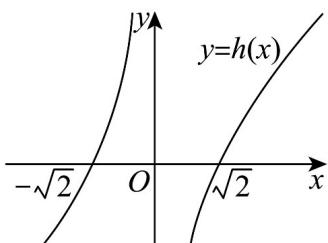
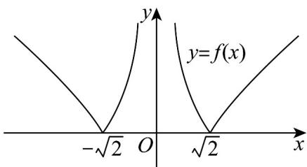
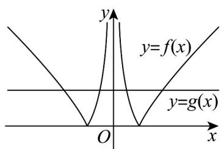
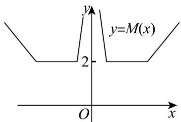
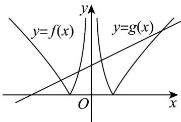
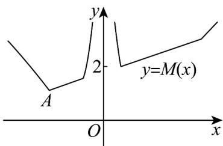
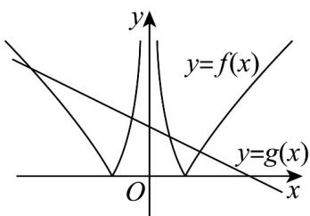
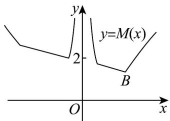

> [!faq]- 《专题05+函数值域考点总结（六大题型）（高效培优期中专项训练）数学人教A版2019高一必修第一册》官方解析
>
> > [!success]- **【答案】** $M(x) = \max \left\{f(x), g(x)\right\}$ ，若 $M(x)$ 的最小值为 1，则实数 $a$ 的值为（）A.0 B.± $\frac{1}{2}$ C.± $\sqrt{2}$ D.±2
>
> > [!note]- **【分析】**
> > 在同一坐标系中作出函数 $f(x)$ ， $g(x)$ 的图象，分 $a = 0$ ， $a > 0$ 和 $a < 0$ 三种情况讨论，画出 $M(x)$ 的图象，数形结合得到取得最小值的点，进而求出该点的坐标，得到答案。
>
> > [!note]- **【解析】**
> > 令 $h(x) = x - \frac{2}{x}$ ，定义域为 $\{x \mid x \neq 0\}$
> >
> > $h(x) = x - \frac{2}{x} = 0$ ，得 $x\pm \sqrt{2}$ ，且 $h(x)$ 在 $(-\infty , - \sqrt{2})$ ， $(\sqrt{2}$ ， $+\infty)$ 单调递增，
> >
> > 所以函数图象如下：
> >
> > 
> >
> > 则 $f(x) = |x - \frac{2}{x}|$ 的图象如下：
> >
> > 
> >
> > 当 $a = 0$ ，则 $g(x) = 2$
> >
> > 在同一坐标系中作出 $f(x), g(x)$ 的图象，如下：
> >
> > 
> >
> > 则 $M(x)$ 的图象如下：
> >
> > 
> >
> > 显然最小值为 $^{2}$ ，不合题意；
> >
> > 当 $a > 0$ ，则 $g(x) = ax + 2$ ，在同一坐标系中作出 $f(x), g(x)$ 的图象，如下：
> >
> > 
> >
> > 画出 $M(x)$ 的图象如下：
> >
> > 
> >
> > 显然函数在 $A$ 点取得最小值，令 $\frac{2}{x} - x = 1$ ，解得 $x = -2$ ，
> >
> > 令 $-2a+2=1$ ，解得 $a=\frac{1}{2}$ ，
> >
> > 当 $a < 0$ ，则 $g(x) = ax + 2$ ，在同一坐标系中作出 $f(x), g(x)$ 的图象，如下：
> >
> > 
> >
> > 画出 $M(x)$ 的图象如下：
> >
> > 
> >
> > 显然函数在 $B$ 点取得最小值，令 $x - \frac{2}{x} = 1$ ，解得 $x = 2$ ，
> >
> > 令 $2a + 2 = 1$ ，解得 $a = -\frac{1}{2}$ ，
> >
> > 综上， $a = \pm \frac{1}{2}$
> >
> > 故选 **B**.
