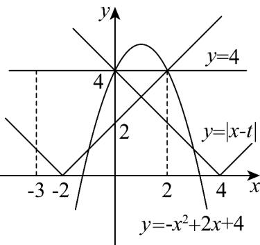
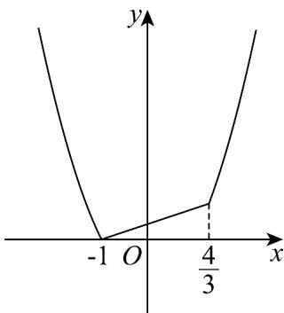

> [!faq]- 《专题05+函数值域考点总结（六大题型）（高效培优期中专项训练）数学人教A版2019高一必修第一册》官方解析
>
> > [!success]- **【答案】** $\{-2,4\}$
>
> > [!note]- **【分析】**
> > 根据定义，先计算 $y = -x^{2} + 2x + 4$ 在 $x \in [-3, 3]$ 上的最大值，然后利用条件函数 $f(x)$ 最大值为 $^{4}$ ，确定 $t$ 的取值即可。
>
> > [!note]- **【解析】**
> > $y = -x^{2} + 2x + 4 = -(x - 1)^{2} + 5$ 在 $x \in [-3, 3]$ 上的最大值为 5，
> >
> > 所以由 $-x^{2}+2x+4=4$ ，解得 x=2 或 x=0，
> >
> > 所以 $x \in (0,2)$ 时， $y = -x^{2} + 2x + 4 > 4$
> >
> > 所以要使函数 $f(x)$ 最大值为 4，则根据定义可知，
> >
> > 当 $t \leq 1$ 时， $y = |x - t|$ 的图象必须经过点 $(2,4)$ ，
> >
> > 即 $x = 2$ 时， $\left|2 - t\right| = 4$ ，此时解得 $t = -2$ ，符合题意；
> >
> > 当 $t > 1$ 时， $y = |x - t|$ 的图象必须经过点 $(0,4)$
> >
> > 即 $x = 0$ 时， $\left|0 - t\right| = 4$ ，此时解得 $t = 4$ ，符合题意。
> >
> > 综上所述， $t = -2$ 或4·
> >
> > 故答案为： $\{-2,4\}$
> >
> > 
> >
> > 39. 给定函数 $f(x) = x^2 - 1, g(x) = \frac{1}{3}x + \frac{1}{3}$ ，用 $M(x)$ 表示函数 $f(x), g(x)$ 中的较大者，即 $M(x) = \max \left\{f(x), g(x)\right\}$ ，则 $M(x)$ 的最小值为（）A.0 B. $\frac{7}{9}$ C. $\frac{1}{4}$ D.2
> >
> > 【答案】A
> >
> > 【分析】由 $M(x) = \max \left\{f(x), g(x)\right\}$ ，写出函数解析式，画出函数图像即可观察得最小值。【详解】令 $x^{2} - 1 = \frac{1}{3} x + \frac{1}{3}$ ，解得 $x = -1$ 或 $x = \frac{4}{3}$ ，
> >
> > 画出函数图像如图所示：
> >
> > 
> >
> > $$
> > M (x) = \max \left\{f (x), g (x) \right\} = \left\{ \begin{array}{l} x ^ {2} - 1, x <   - 1 \\ \frac {1}{3} x + \frac {1}{3}, - 1 \leq x \leq \frac {4}{3} \\ x ^ {2} - 1, x > \frac {4}{3} \end{array} \right.
> > $$
> >
> > 由函数图像可知， $M(x)$ 的最小值为0.
> >
> > 故选 **A**
