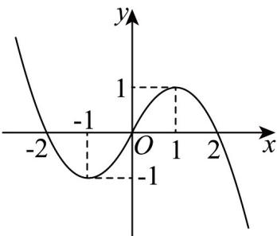

> [!faq]- 《专题06+函数解析式考点总结（六大题型）（高效培优期中专项训练）数学人教A版2019高一必修第一册》官方解析
>
> > [!success]- **【答案】** $f(x) = -x^{2} + 2x$ $(-2,0)\cup (0,2)$
>
> > [!note]- **【分析】**
> > 利用函数是奇函数即可求出当 $x > 0$ 时，函数 $f(x)$ 的解析式；由函数是奇函数化简
> >
> > $x^{3}[f(x) - f(-x)] > 0$ 可得 $2x^{3}f(x) > 0$ ，画出函数 $f(x)$ 的图象，结合图象即可得出答案.
>
> > [!note]- **【解析】**
> > 由 $f(x)$ 为奇函数，得 $f(-x) = -f(x)$
> >
> > 当 $x > 0$ 时， $-x < 0$ ，故 $f(-x) = -f(x) = (-x)^2 + 2(-x) = x^2 - 2x$ ，故当 $x > 0$ 时， $f(x) = -x^2 + 2x$
> >
> > 由 $f(-x) = -f(x)$ ，得 $x^{3}[f(x) - f(-x)] = x^{3}[f(x) + f(x)] = 2x^{3}f(x)$
> >
> > 故 $x^{3}[f(x) - f(-x)] > 0 \Leftrightarrow 2x^{3}f(x) > 0 \Leftrightarrow \left\{ \begin{array}{l} x > 0 \\ f(x) > 0 \end{array} \right.$ 或 $\left\{ \begin{array}{l} x < 0 \\ f(x) < 0 \end{array} \right.$ ，
> >
> > 如图所示，画出函数 $f(x)$ 的图象，
> >
> > 
> >
> > 由图易得 $\left\{ \begin{array}{l} x > 0 \\ f(x) > 0 \end{array} \right.$ 的解集为 $(0,2), \left\{ \begin{array}{l} x < 0 \\ f(x) < 0 \end{array} \right.$ 的解集为 $(-2,0)$ ，
> >
> > 故不等式 $x^{3}[f(x)-f(-x)]>0$ 的解集为 $(-2,0)\cup(0,2)$ .
> >
> > 故答案为： $f(x)=-x^{2}+2x$ ； $(-2,0)\cup(0,2)$ .
