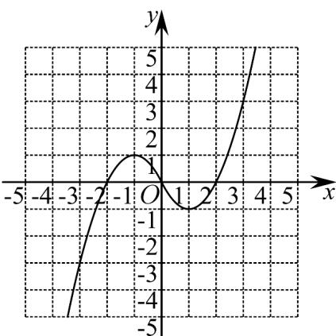

> [!faq]- 《专题06+函数解析式考点总结（六大题型）（高效培优期中专项训练）数学人教A版2019高一必修第一册》官方解析
>
> > [!success]- **【答案】** (1) $f(x)=\left\{\begin{aligned}-x^{2}-2x,x&\leq0\\ x^{2}-2x,x&>0\end{aligned}\right.$ (2) $f(x)_{\min}=\begin{cases}-t^{2}-2t,t<-2\\t^{2}+2t,-2\leq t<-1\\-1,-1\leq t<1\\t^{2}-2t,t\quad1\end{cases}$
>
> > [!note]- **【分析】**
> > （1）由已知结合奇函数性质先求 $a$ ，然后结合奇函数定义即可求解函数解析式；
> >
> > (2) 先判断函数的单调性，结合单调性即可求解函数最值.
>
> > [!note]- **【解析】**
> > （1）由 $f(x)$ 是定义在R上的奇函数，且当 $x \leq 0$ 时， $f(x) = -x^2 + 2ax + a + 1$ ，
> >
> > 则 $f(0) = a + 1 = 0$ ，解得 $a = -1$ ，即 $x \leq 0$ 时， $f(x) = -x^2 - 2x$
> >
> > 当 $x > 0$ 时， $-x <   0$ ， $f(x) = -f(-x) = -\left[-(-x)^{2} - 2(-x)\right] = x^{2} - 2x$
> >
> > 故 $f(x)=\left\{\begin{aligned}-x^{2}-2x,&x\leq0\\ x^{2}-2x,&x>0\end{aligned}\right.$ ;
> >
> > (2) 作出函数 $f(x)$ 的大致图象如图所示：
> >
> > 
> >
> > 当 $t$ 1时，函数 $f(x)$ 在 $[t, t + 2]$ 上单调递增，则 $f(x)_{\min} = f(t) = t^2 - 2t$ ；
> >
> > 当 $-1 \leq t < 1$ ， $1 \leq t + 2 < 3$ ，函数 $f(x)$ 在 $[t, 1]$ 上单调递减，在 $[1, t + 2]$ 上单调递增，
> >
> > 此时 $f(x)_{\min}=f(1)=-1$ ;
> >
> > 当 $\left\{ \begin{array}{l} t < -1, \\ 0 \leq t + 2 < 1 \end{array} \right.$ ，即 $-2 \leq t < -1$ 时，函数 $f(x)$ 在 $[t, -1]$ 上单调递增，在 $[-1, t + 2]$ 上单调递减，
> >
> > $$
> > f (t) = - t ^ {2} - 2 t, f (t + 2) = (t + 2) ^ {2} - 2 (t + 2) = t ^ {2} + 2 t
> > $$
> >
> > 则 $f(t + 2) - f(t) = (t^2 + 2t) - (-t^2 - 2t) = 2t(t + 2) \leq 0$ ，则 $f(t + 2) \leq f(t)$
> >
> > 则 $f(x)_{\min} = f(t + 2) = t^2 + 2t$
> >
> > 当 $-1 < t + 2 < 0$ ，即 $-5 < t < -2$ 时，函数 $f(x)$ 在 $[t, -1]$ 上单调递增，在 $[-1, t + 2]$ 上单调递减， $f(t) = -t^2 - 2t$ ， $f(t + 2) = -(t + 2)^2 - 2(t + 2) = -t^2 - 6t - 8$ ，则 $f(t + 2) - f(t) = (-t^2 - 6t - 8) - (-t^2 - 2t) = -4t - 8 = -4(t + 2) > 0$ ，则 $f(t + 2) > f(t)$ ，所以 $f(x)_{\min} = f(t) = -t^2 - 2t$
> >
> > 当 $t + 2 \leq -1$ 时，即当 $t£ - 3$ 时，函数 $f(x)$ 在 $[t, t + 2]$ 上单调递增，
> >
> > 此时 $f(x)_{\min} = f(t) = -t^2 - 2t$
> >
> > 综上所述， $f(x)_{\min}=\begin{cases}-t^{2}-2t,t<-2\\t^{2}+2t,-2\leq t<-1\\-1,-1\leq t<1\\t^{2}-2t,t\quad1\end{cases}$
