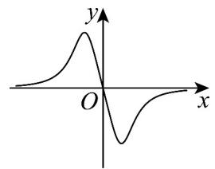
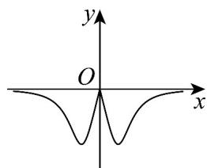
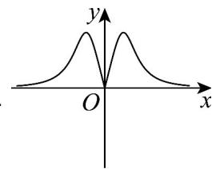
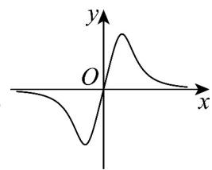

> [!faq]- 《专题08+幂函数考点总结（六大题型）（高效培优期中专项训练）数学人教A版2019高一必修第一册》官方解析
>
> > [!success]- **【答案】** D
>
> > [!note]- **【分析】**
> > 利用基本初等函数的单调性进行判断，对四个选项逐一分析判断即可·
>
> > [!note]- **【解析】**
> > 对选项 A，因为 $f(x)=\frac{1}{x}$ 在 $(0,+\infty)$ 上单调递减，故选项 A 错误；
> >
> > 对选项 B，因为 $f(x) = -x^{3}$ 在 $(0, +\infty)$ 上单调递减，故选项 B 错误；
> >
> > 对选项 C，因为 $g(x) = -2x + 1$ 在 $(0, +\infty)$ 上单调递减，故选项 C 错误；
> >
> > 对选项D，因为 $g(x) = x^2 + 2x$ 在 $(- \infty, -1)$ 上单调递减，在 $(-1, +\infty)$ 上单调递增，
> >
> > 所以 $g(x)=x^{2}+2x$ 在 $(0,+\infty)$ 上单调递增.
> >
> > 故选：D.
> >
> > ## 考点05 幂函数奇偶性考点
> >
> > 41. 使幂函数 $y = x^{\alpha}$ 为偶函数，且在 $(0, +\infty)$ 上是减函数的 $\alpha$ 值为（）A.-1 B. $\frac{1}{2}$ C.-2 D.2
> >
> > 【答案】C
> >
> > 【分析】由幂函数单调性，奇偶性可得答案·
> >
> > 【详解】因 $y = x^{\alpha}$ 为偶函数，则 $\alpha$ 不能为-1， $\frac{1}{2}$ ， $\alpha$ 可以为-2，2·
> >
> > 又 $y = x^{\alpha}$ 在 $(0, +\infty)$ 上是减函数，则 $\alpha = -2 \cdot$
> >
> > 故选：C
> >
> > 42. 函数 $f(x) = \frac{4x}{1 + x^4}$ 的图象大致是（）
> >
> > 【答案】
> >
> > A
> > 
> > B
> >
> > 
> > C
> >
> > 
> >
> > D
> > 
> >
> > 【答案】D
> >
> > 【分析】根据奇偶性可排除 B 和 C；根据 x > 0 时， $f(x) > 0$ 可排除 A.
> >
> > 【详解】函数 $f(x)$ 的定义域为 R， $f(-x)=\frac{4(-x)}{1+(-x)^{4}}=-\frac{4x}{1+x^{4}}=-f(x)$
> >
> > 所以函数 $f(x)$ 为奇函数，故排除 B 和 C；
> >
> > 当 $x > 0$ 时， $f(x) = \frac{4x}{1 + x^4} > 0$ ，故排除A.
> >
> > 故选 **D**.
