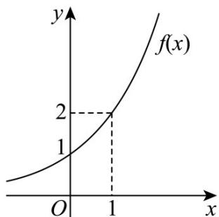

> [!faq]- 《专题10 指数函数考点大汇总（六大题型）（高效培优期中专项训练）数学人教A版2019高一必修第一册》官方解析
>
> > [!success]- **【答案】** (1) $f(x)=2^{x}$ (2)作图见解析， $(1,+\infty)$
>
> > [!note]- **【分析】**
> > （1）设指数函数 $f(x) = a^{x}$ ，将点 $(24)$ 代入，求得 $a = 2$ ，即可求解；
> >
> > (2) 画出函数 $f(x) = 2^x$ 的图象，得到 $f(x)$ 在 R 上单调递增，把不等式转化为 $2x > -x + 3$ ，即可求解。
>
> > [!note]- **【解析】**
> > （1）设指数函数 $f(x) = a^x$ ， $a > 0$ 且 $a \neq 1$ ，
> >
> > 把点 $(2,4)$ 代入 $f(x)$ ，可得 $a^{2}=4$ ，解得a=2，
> >
> > 所以函数 $f(x)$ 的解析式为 $f(x) = 2^{x}$ .
> >
> > (2) 画出指数函数 $f(x) = 2^x$ 的图象，如图所示，
> >
> > 
> >
> > 所以函数 $f(x) = 2^{x}$ 在R上单调递增；
> >
> > 由不等式 $f(2x) > f(-x + 3)$ ，可得 $2x > -x + 3$ ，解得 x > 1，
> >
> > 故不等式的解集为 $(1, +\infty)$ .
