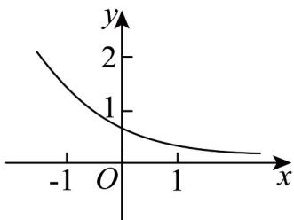
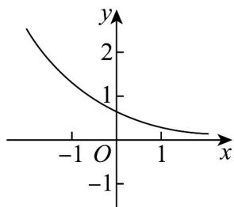

> [!faq]- 《专题10 指数函数考点大汇总（六大题型）（高效培优期中专项训练）数学人教A版2019高一必修第一册》官方解析
>
> > [!success]- **【答案】** (1) $f(x)=2^{x}$ (2) $[4,13]$
>
> > [!note]- **【分析】**
> > （1）将 $(3,8)$ 代入即可求解a=2，
> >
> > (2) 利用换元法，结合指数函数以及二次函数的单调性即可求解.
>
> > [!note]- **【解析】**
> > （1）因为函数 $f(x) = a^{x}$ （ $a > 0$ 且 $a \neq 1$ ）的图象过点 $(3,8)$ ，则 $f(3) = a^3 = 8$ ，解得 $a = 2$ ，因此， $f(x) = 2^x$ .
> >
> > (2) $g(x) = (2^x)^2 - 2 \times 2^x + 5$ ，令 $t = 2^x$ ，因为 $x \in [-1, 2]$ ，则 $t \in \left[\frac{1}{2}, 4\right]$ .
> >
> > 令 $h(t)=t^{2}-2t+5=(t-1)^{2}+4$
> >
> > 当 $t \in \left[\frac{1}{2}, 1\right]$ 时，函数 $h(t)$ 单调递减，此时， $x \in [-1, 0]$ ，
> >
> > 当 $t \in (1,4]$ 时，函数 $h(t)$ 单调递增，此时， $x \in (0,2]$
> >
> > 故当 $x \in [-1, 2]$ 时， $g(x)_{\min} = g(0) = 4$
> >
> > 又因为 $g(-1) = \left(\frac{1}{2} - 1\right)^2 + 4 = \frac{17}{4}, g(2) = (4 - 1)^2 + 4 = 13$ ，故 $g(x)_{\max} = 13$ ，
> >
> > 所以，函数 $g(x)$ 在 $[-1,2]$ 上的值域为 $[4,13]$ .
> >
> > ## 考点02 根据指数型函数图象判断参数范围
> >
> > 11. 函数 $f(x) = a^{x} - b$ 的图象如图，其中 $a, b$ 为常数，则下列结论正确的是（）
> >
> > 【答案】
> >
> > 
> >
> > A. $a > 1, b < 0$ B. $a > 1, b > 0$ C. $0 < a < 1, b > 0$ D. $0 < a < 1, b < 0$
> >
> > 【答案】C
> >
> > 【分析】根据 $f(0)$ 判断 b 的范围，根据图象趋势判断 a 的范围即可.
> >
> > 【详解】由图象可知： $0 < f(0) = 1 - b < 1$ ， $\therefore 0 < b < 1$
> >
> > 又由函数 $f(x) = a^{x} - b$ 为减函数，可得 $0 < a < 1$
> >
> > 故选：C.
> >
> > 12. 函数 $f(x) = a^{x - b}$ 的图象如图所示，其中 $a, b$ 为常数，则下列结论正确的是（）
> >
> > 【答案】
> >
> > 
> >
> > A. $a > 1, b < 0$ B. $a > 1, b > 0$
> >
> > C $0 < a < 1$ $b > 0$ D $0 < a < 1$ $b < 0$
> >
> > 【答案】D
> >
> > 【分析】根据指数函数单调性得到0<a<1，根据 $0<f(0)<1$ 得到b<0.
> >
> > 【详解】由于 $f(x) = a^{x - b}$ 的图象单调递减，所以 $0 < a < 1$
> >
> > 又 $0 < f(0) < 1$ ，所以 $0 < a^{-b} < 1 = a^0$ ，即 $-b > 0$ ， $b < 0\cdot$
> >
> > 故选 **D**.
