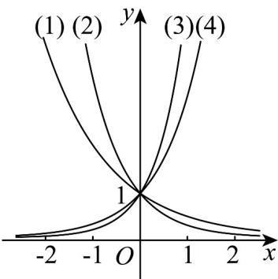
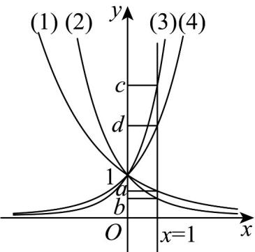

> [!faq]- 《专题10 指数函数考点大汇总（六大题型）（高效培优期中专项训练）数学人教A版2019高一必修第一册》官方解析
>
> > [!success]- **【答案】** 
>
> > [!note]- **【分析】**
> > 利用取特殊交点的纵坐标就是各个底数的大小，即可比较大小
>
> > [!note]- **【解析】**
> > 作直线 x=1 与四个指数函数图象相交，
> >
> > 
> >
> > 由图可得 $c^1 > d^1 > 1 > a^1 > b^1$ ，即 $c > d > 1 > a > b$
> >
> > 故答案为： $c > d > 1 > a > b$
