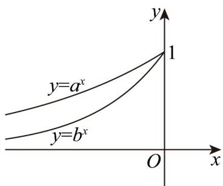

> [!faq]- 《专题10 指数函数考点大汇总（六大题型）（高效培优期中专项训练）数学人教A版2019高一必修第一册》官方解析
>
> > [!success]- **【答案】**  A. $0 < b < a < 1$ B. $0 < a < b < 1$ C. $a > b > 1$ D. $b > a > 1$
>
> > [!note]- **【分析】**
> > 先根据函数单调性得到 a > 1，b > 1，并当 x = -1 时， $a^{-1} > b^{-1}$ ，得 a < b，所以 b > a > 1。
>
> > [!note]- **【解析】**
> > 由图可知函数 $y = a^{x}$ ， $y = b^{x}$ 均单调递增，则 a > 1，b > 1。
> >
> > 当 $x = -1$ 时， $a^{-1} = \frac{1}{a} > b^{-1} = \frac{1}{b}$ ，得 $a < b$ ，所以 $b > a > 1$ 。
> >
> > 故选 **D**
