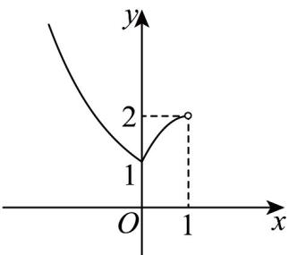

> [!faq]- 《专题10 指数函数考点大汇总（六大题型）（高效培优期中专项训练）数学人教A版2019高一必修第一册》官方解析
>
> > [!success]- **【答案】** $(-∞,0)$
>
> > [!note]- **【分析】**
> > 作出 $f(x)$ 在 $(- \infty, 1)$ 的图象，通过分析 $a$ 的位置可确定 $f(x)$ 何时有最小值，从而确定 $a$ 的范围。【详解】由指数函数和二次函数图象可得 $f(x)$ 在 $(- \infty, 1)$ 上的图象如下图所示，
>
> > [!note]- **【解析】**
> > 
> > 显然当 $a < 0$ 时， $f(x) = f(0) = 1$ ，此时 $f(x)$ 有最小值；
> > 当 $0 \leq a < 1$ 时， $f(x) > f(a)$ ，没有最小值，
> > ∴实数a的取值范围为 $(-∞,0)$ .
> > 故答案为： $(-∞,0)$ .
