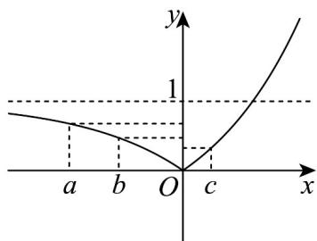

> [!faq]- 《专题10 指数函数考点大汇总（六大题型）（高效培优期中专项训练）数学人教A版2019高一必修第一册》官方解析
>
> > [!success]- **【答案】** AD
>
> > [!note]- **【分析】**
> > 作出函数 $f(x)$ 的图象，由数形结合判断四个选项的正误
>
> > [!note]- **【解析】**
> > $f(x)$ 的图象如下图所示，由图可知 $f(x)$ 在 $(- \infty, 0)$ 单调递减，在 $[0, +\infty)$ 上单调递增因为 $a < b < c$ ，
> >
> > 若 $c < 0$ ，因为 $f(x)$ 在 $(- \infty, 0)$ 单调递减，此时不满足 $f(a) > f(c) > f(b)$
> >
> > 所以 $c > 0$ ，同理可得 $a < 0$ ， $\therefore a < 0 < c$
> >
> > 因为 $f(a) > f(c)$ ，所以 $|a| > c$
> >
> > 所以 -a > c ，即 $a + c < 0$ ，A 对·
> >
> > $$
> > f (a) = \left| 2 ^ {a} - 1 \right| = 1 - 2 ^ {a} > f (c) = 2 ^ {c} - 1
> > $$
> >
> > 即 $2^{a}+2^{c}<2$ ，C错.
> >
> > 若 $b > 0$ ，因为 $f(a) > f(c) > f(b)$
> >
> > 所以 $|a| > c > b > 0 > a$
> >
> > 此时 $b+c>0$ ，C 错， $2^{b}+2^{c}>2^{0}+2^{0}=2$ ，D 对·
> >
> > 若 $b < 0$ ，因为 $f(a) > f(c) > f(b)$
> >
> > 所以 $|a| > |b| > c > 0 > b > a$
> >
> > $$
> > f (c) = 2 ^ {c} - 1 > f (b) = \left| 2 ^ {b} - 1 \right| = 1 - 2 ^ {b}
> > $$
> >
> > 即 $2^{b} + 2^{c} > 2$
> >
> > 综上所述，D 对·
> >
> > 故选：AD
> >
> > 
