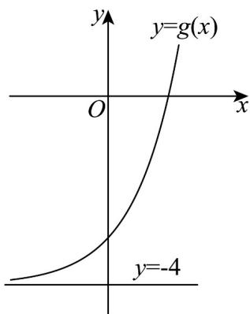

> [!faq]- 《专题10 指数函数考点大汇总（六大题型）（高效培优期中专项训练）数学人教A版2019高一必修第一册》官方解析
>
> > [!success]- **【答案】** B
>
> > [!note]- **【分析】**
> > 利用指数函数的性质，得到 $M(3,4)$ ，从而 $g(x) = 3^x - 4$ ，再利用图象的变化得到 $g(x) = 3^x - 4$ 的图象，即可求解·
>
> > [!note]- **【解析】**
> > 因为函数 $f(x) = a^{x - 3} + 3(a > 0, a \neq 1)$ 恒过点 $M(3,4)$ ，所以 $g(x) = 3^x - 4$ ，其图象可由 $y = 3^x$ 向下平移4个单位得到，图象如图，
> >
> > 
> >
> > 由图知 $g(x)=3^{x}-4$ 不经过第二象限，
> >
> > 故选：B.
> >
> > 30. 幂函数 $f(x) = (m^2 - 2m - 2)x^m$ 在 $(0, +\infty)$ 上单调递增，则 $g(x) = a^{x - m} + 1(a > 1)$ 的图像过定点 \_\_\_\_.
> >
> > 【答案】 $(3,2)$
> >
> > 【分析】由幂函数定义得到 $m^{2}-2m-2=1$ 且m>0，解得m=3，结合指数函数的性质，得到定点坐标
> >
> > 【详解】由题意得 $m^2 - 2m - 2 = 1$ 且 $m > 0$ ，解得 $m = 3$ 或 $-1$ （舍去），
> >
> > 故 $g(x) = a^{x - 3} + 1(a > 1)$ ，令 $x - 3 = 0$ ，得 $x = 3$ ，此时 $g(3) = a^0 +1 = 2$
> >
> > 故 $g(x)=a^{x-3}+1(a>1)$ 的图象过定点 $(3,2)$ .
> >
> > 故答案为：(3,2)
> >
> > ## 考点04 指数型函数值域问题
