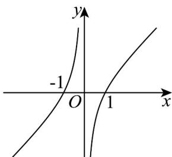

> [!faq]- 《专题10 指数函数考点大汇总（六大题型）（高效培优期中专项训练）数学人教A版2019高一必修第一册》官方解析
>
> > [!success]- **【答案】** A. $y = 2^{x}$ B. $y = 2x^{2}$ C. $y = x - \frac{1}{x}$ D. $y = \frac{1}{x}$
>
> > [!note]- **【分析】**
> > 根据指数函数、反函数、二次函数的性质和图象进行逐一判断·
>
> > [!note]- **【解析】**
> > 对于选项 A：
> >
> > 因为 $y = 2^{x}$ 为指数函数，所以其值域为 $(0, +\infty)$ .
> >
> > 对于选项 B :
> >
> > 因为 $y = 2x^{2}$ 为二次函数，抛物线开口向上，其值域为 $[0, +\infty)$ .
> >
> > 对于选项 C :
> >
> > 因为 $y = x - \frac{1}{x}$ ，其图象为：
> >
> > 
> >
> > 可以看出其值域为 R·
> >
> > 对于选项 D :
> >
> > 因为 $y=\frac{1}{x}$ 是反函数，所以其值域为 $(-∞,0)∪(0,+∞)·$
> >
> > 故选 **C**.
