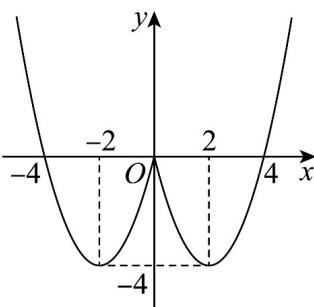

> [!faq]- 《期中复习（易错点12+易错题64+考点32）（高效培优期中专项训练）数学人教A版高一必修第一册》官方解析
>
> > [!success]- **【答案】** (1) $f(x)=\left\{\begin{aligned}x^{2}+4x,x&<0\\ x^{2}-4x,x&0\end{aligned}\right.$ $$ \left(- \frac {5}{2}, - \frac {3}{2} \right] \tag {2} $$
>
> > [!note]- **【分析】**
> > （1）根据函数是偶函数结合分段函数解析式求解；
> >
> > (2) 根据函数单调性列不等式计算求参.
>
> > [!note]- **【解析】**
> > （1）由题意知 $y = f(x)$ 是定义在R上的偶函数，当 $x = 0$ 时， $f(x) = x^2 - 4x$
> >
> > 故当 $x < 0$ 时， $f(x) = f(-x) = x^2 + 4x$
> >
> > 故函数 $f(x)$ 在 R 上的解析式为 $f(x)=\left\{\begin{aligned}x^{2}+4x,x&<0\\ x^{2}-4x,x&0\end{aligned}\right.$ ;
> >
> > (2) 作出函数 $f(x) = \begin{cases} x^2 + 4x, & x < 0 \\ x^2 - 4x, & x = 0 \end{cases}$ 的图象如图：
> >
> > 
> >
> > 结合图象可得，若函数 $f(x)$ 在区间 $[-2, 2m + 3]$ 上单调递增，
> >
> > 需满足 $-2 < 2m + 3 \leq 0$ ，即 $-\frac{5}{2} < m \leq -\frac{3}{2}$ .
